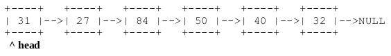
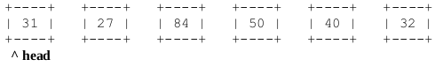
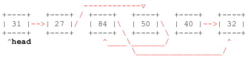
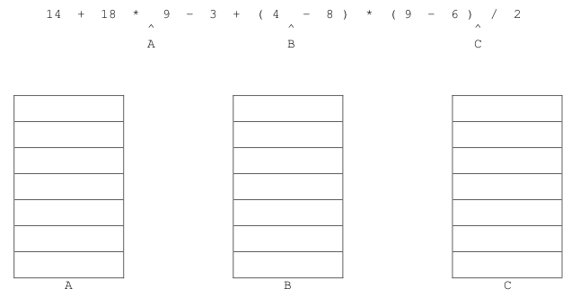
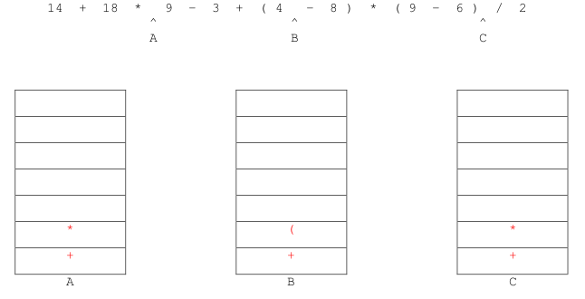
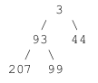
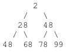
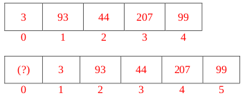
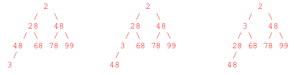

# Fall 2016

## Data Structures

### A 1: Dynamic Memory Management in C



#### 10 points

Consider the following struct, which contains a string and its length in one nice, neat package:

```c
typedef struct smart_string
{
  char *word;
  int length;
} smart_string;
```

Write a function that takes a string as its input, creates a new `smart_string` struct, and stores a **new copy of that string** in the _word_ field of the struct and the length of that string in the _length_ member of the struct. The function should then return a pointer to that new `smart_string` struct. Use dynamic memory management as necessary. The function signature is:

```c
smart_string *create_smart_string(char *str)
{
  // your code
}
```

Now write a function that takes a `smart_string` pointer \(which might be NULL\) as its only argument, frees all dynamically allocated memory associated with that struct, and returns NULL when it’s finished.

```c
smart_string *erase_smart_string(smart_string *s)
{
  // your code
}
```



```c
smart_string *create_smart_string(char *str)
{
  smart_string *s = malloc(sizeof(smart_string));
  s->length = strlen(str);
  s->word = malloc(sizeof(char) * (s->length + 1));
  strcpy(s->word, str);
  return s;
}
```

**Grading 7 pts:**
- 1 pt for `smart_string` declaration
- 1 pt for first `malloc()`
- 1 pt for setting length correctly
- 1 pt for `sizeof(char)` in second `malloc()`
- 1 pt for `(s-&gt;length + 1)` in second `malloc()`
- 1 pt for using `strcpy`
- 1 pt for correct return statement. 

Note: They can also use `calloc()`. Please deduct a point for other large, obvious errors (such as using the . operator instead of the -&gt; operator).

```c
smart_string *erase_smart_string(smart_string *s)
{
  if (s != NULL)
  {
    free(s->word); // This is safe, even if word is NULL.
    free(s);
  }

  return NULL;
}
```

**Grading (3 pts):**
- 1 pt for checking s != NULL
- 1 pt for free(s-&gt;word)
- 1 pt for free(s)




### A 2: Linked Lists



#### 5 points

Consider the following function, which takes the head of a linked list as its only input parameter:

```c
node *funky(node *head)
{
  if (head == NULL)
    return head;

  if (head->next != NULL && (head->next->data % 2) == 0)
  {
    head->next = yknuf(head->next->next, head->next);
    head = funky(head->next->next);
  }
  else if (head->next != NULL)
    head->next = funky(head->next);

  return head;
}

node *yknuf(node *n1, node *n2)
{
  n2->next = n1->next->next;
  n1->next = n2;
  return n1;
}
```

Suppose someone passes the head of the following linked list to the `funky()` function:



The function call is: `funky(head)`;

This program is going to crash spectacularly, but before it does, it will change the structure of the linked list a bit. Trace through the function call\(s\) and draw a new diagram that shows how the links in this linked list will be arranged at the moment when the program crashes. \(In particular, show where the next pointer for each node except the one storing 32 will point.\)







In other words, node 31 points to node 27, 27 points to 50, 50 points back to 84, 84 points to 32, and 40 also points to 32

_**Grading (5 pts): 1 pt for each correct ‘next’ pointer.**_




### A 3: Stacks: Infix to Postfix Conversion



#### 10 points

Convert the following from an infix expression to a postfix expression. Show the state of the operator stack at each of the indicated points \(A, B, and C\):



Give the final postfix expression here: **\_**

What is the final value of this postfix expression? **\_**





Give the final postfix expression here: 14 18 9  _+ 3 - 4 8 - 9 6 -_  2 / +

What is the final value of this postfix expression?: 167

**Grading (10 pts):**
- 5 pts for the correct stack contents (give 1 pt for each symbol, but subtract a pt for each incorrect symbol, but then award a max of 5 and min of 0 pts for this part – no negative scores)- 4 pts for correct postfix expression (-0.5 pts for each error, but take the floor of the number of points they earn for this part), and 1 pt for final value (167).




### B 1: Binary Trees




#### 10 points

A binary search tree is considered “lopsided” if the root’s left subtree height and right subtree height differ by more than one (i.e., the left subtree is more than one level deeper or shallower than the right subtree). This is different from the definition of “balanced” that comes up in relation to AVL trees, because the “lopsided” property only applies to the root of the tree – not every single node in the tree.

Write a function, `isLopsided()`, that takes the root of a binary search tree and returns 1 if the tree is lopsided, and 0 otherwise. You may write helper functions as you see fit. The node struct and function signature are as follows:

```c
typedef struct node
{
  struct node *left, *right;
  int data;
} node;

int isLopsided(node *root)
{
  // your code
}
```




```c
typedef struct node
{
  struct node *left, *right;
  int data;
} node;

int isLopsided(node *root)
{
  int lHeight, rHeight, diff;

  if (root == NULL) return 0;
  
  lHeight = height(root->left);
  rHeight = height(root->right);
  diff = lHeight – rHeight;
  
  return (diff >= 2 || diff <= -2);
}

int max(int a, int b)
{
  return (a > b) ? a : b;
}

int height(node *root)
{
  if (root == NULL) return -1;
  return 1 + max(height(root->left), height(root->right));
}
```

**Grading**
- 2 pts for checking root == NULL in isLopsided()
- 2 pts for realizing they need to write a separate height() function
- 3 pts for the rest of the logic in isLopsided, such as the diff check (award partial credit as you deem fit)
- 3 pts for the logic in height() (award partial credit as you deem fit)

Note - for this particular question, if height returns 0 for null tree, that is fine since all that matters for correctness here is relative height.




### B 2: Advanced Data Structures: Binary Heaps




#### 5 points

**(a)** (2 pts) Is the following tree a valid minheap? If so, give an array representation of this minheap. If not, explain why it’s not a minheap.



**(b)** (3 pts) Insert the value 3 into the following minheap. Clearly show each step of the process.







**(a)**


Yes, this is a valid minheap. Both of the following array representations are acceptable:



**_Grading (2 pts): -1 for a very minor error. Otherwise, it’s 2 pts if correct, 0 if not._**

**(b)**


Step 1: Insert 3 into the next available position (left child of 48)

Step 2: The 3 percolates up (twice).



**Grading (5 pts):**
- 2 pts: The 3 is inserted into the correct position to begin with.
- 2 pts: The 3 ends up in the correct position after percolating up.
- 1 pt: Nothing else ended up in the wrong place after percolating.




### B 3: Advanced Tree Structures: Trie




#### 10 points

Write a recursive function that takes the root of a trie and counts how many odd-lengthed strings there are in the trie. For example, if the trie contains the empty string (“”), “bananas”, “avocados”, and “randomness”, the function should return 1, because only one of those strings has a length that is odd (“bananas”).

We will make our initial call to your function like so: `countOddStrings(root, 0)`;

Part of the fun in this problem is figuring out what to do with that second parameter.

Please do **NOT** write any helper functions. Restrict yourself to the function whose signature is given below.

```c
typedef struct TrieNode
{
  struct TrieNode *children[26];
  int flag; // 1 if the string is in the trie, 0 otherwise
} TrieNode;

int countOddStrings(TrieNode *root, int k)
{
  // your code
}
```





```c
typedef struct TrieNode
{
  struct TrieNode *children[26];
  int flag; // 1 if the string is in the trie, 0 otherwise
} TrieNode;

int countOddStrings(TrieNode *root, int k)
{
  int total = 0;

  if (root == NULL)
    return 0;
  
  if (k % 2 == 1 && root->flag == 1) total++;
  
  for (i = 0; i < 26; i++)
    total += countOddStrings(root->children[i], k + 1);
  
  return total;
}
```

Note: An alternate solution is to pass (k + 1) % 2 in the recursive call, so the k keeps toggling  (even) and 1 (odd).

**Grading (10 pts):**
- 1 pts for checking root == NULL as a base case.
- 2 pts the line that increments total if k % 2 == 1 and root->flag == 1 (award partial credit)
- 2 pts for the for loop (double check that the range of ‘i’ is valid)
- 2 pts for the recursive call (make sure they use k + 1 and not k++ or ++k, as the latter two cause issues)
- 2 pts for capturing the return values of the recursive calls and using them to increment total
- 1 pt for returning total




## Algorithms and Analysis Tools

### A 1: Algorithm Analysis



#### 10 points







### A 2: Algorithm Analysis



#### 5 points







### A 3: Summations and Recurrence Relations



#### 10 points







### B 1: Recursive Coding



#### 10 points







### B 2: Sorting



#### 10 points







### B 3: Bitwise Operators



#### 5 points







## PDF Files







