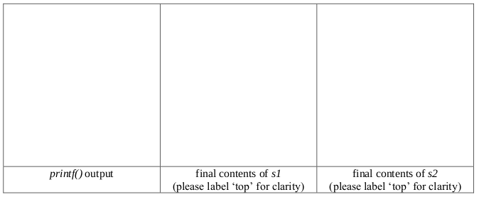
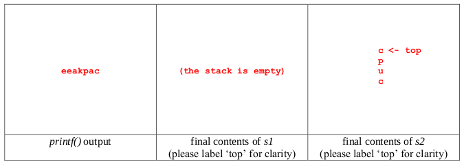
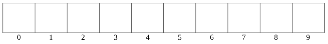
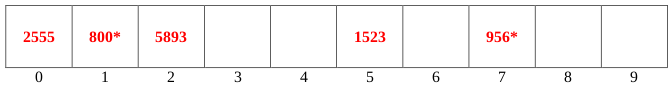

# Fall 2017

## Data Structures

### A 1: Dynamic Memory Management in C



#### 5 points

There is something terribly wrong with the code given below: it has two memory leaks. After carefully inspecting the code, answer the questions below.

```c
int main(void)
{
  char *str1 = malloc(sizeof(char) * 16);
  char *str2 = malloc(sizeof(char) * 16);

  str1[0] = 'p';
  str1[1] = 'a';
  str1[2] = 's';
  str1[3] = 's';
  str1[4] = ',';
  str1[5] = '\0';

  printf("%s ", str1);
  str2 = str1;
  printf("%s ", str2);
  str2 = NULL;
  strcpy(str1, "pass the exam!");
  printf("%s\n", str1);

  free(str1);
  free(str2);

  return 0;
}
```

**\(a\)** \(3 pts\) Draw a picture that indicates the relevant state of memory _**after**_ line 14 has completed. \(Draw a rectangular box to indicate dynamically allocated memory.\)

**\(b\)** \(1 pt\) Explain why line 14 causes a memory leak.

**\(c\)** Why is it possible for the code to crash on line 21?



**\(a\)** Note: All cells left empty represent uninitialized character variables.


_**Grading: 1 pt for having two boxes drawn indicating allocated memory. 1 pt for having str1 point to the box that stores "pass," \(this must be indicated\), 1 pt for having str2 point to this same box.**_

**\(b\)** When the pointer str2 moves, nothing is pointing to the memory that it used to be pointing to originally.

_**Grading: 1 pt**_

**\(c\)** str2 is pointing to NULL \(nothing\), so it's not pointing to dynamically allocated memory. Attempting to free memory that isn't dynamically allocated may crash a program.

_**Grading parts \(b\) and \(c\): Give the point for each if the answer is reasonably close or shows that the student understands the key issue at hand. No half points! Only award an integer number of points.**_



### A 2: Linked Lists



#### 10 points

Write a _**recursive**_ function that takes in the head of a linked list and frees all dynamically allocated memory associated with that list. You may assume that _**all**_ the nodes in any linked list passed to your function \(including the head node\) have been dynamically allocated. It’s possible that your function might receive an empty linked list \(i.e., a NULL pointer\), and you should handle that case appropriately.

Note that your function must be recursive in order to be eligible for credit.

The linked list node struct and the function signature are as follows:

```c
typedef struct node
{
  struct node *next;
  int data;
} node;

void destroy_list(node *head)
{
  // your code
}
```



```c
typedef struct node
{
  struct node *next;
  int data;
} node;

void destroy_list(node *head)
{
  if (head == NULL)
    return;

  destroy_list(head->next);
  free(head);
}
```

_**Grading: Award 3 pts for correctly handling the base case. Award 3 points for a correct recursive call. Award 4 points for freeing head after the recursive call.**_

**Note**: Some students might set head-&gt;next to NULL before freeing head., which causes some unnecessary computation, but doesn’t render their solution incorrect. You can ignore that.

However, if they set head itself to NULL before freeing it, they should not be eligible to receive the 4 points for freeing head after the recursive call.



### A 3: Stacks



#### 10 points

Suppose we pass the string “cupcake” to the following function. What will the function’s output be, and what will the stacks _s1_ and _s2_ look like when the function terminates? You may assume the stack functions are written correctly and that the stacks are designed for holding characters.

```c
void string_shenanigans(char *str)
{
  int i, len = strlen(str);
  char *new_string = malloc(sizeof(char) * (len + 1));
  Stack s1, s2;
  init(&s1); // initializes stack s1 to be empty
  init(&s2); // initializes stack s2 to be empty

  for (i = 0; i < len; i++)
  {
    push(&s1, str[i]); // this pushes onto stack s1
    push(&s2, str[i]); // this pushes onto stack s2
  }

  for (i = 0; i < len; i++)
  {
    if (i % 2 == 0)
    {
      // Note: pop() returns the character being removed from the stack.
      if (!isEmpty(&s1))
        new_string[i] = pop(&s1);
      if (!isEmpty(&s1))
        push(&s2, pop(&s1));
    }
    else
    {
      pop(&s2);
      new_string[i] = pop(&s2);
    }
  }

  new_string[len] = '\0';
  printf("%s\n", new_string);
  free(new_string);
}
```







_**Grading: Award 7 points for the correct output \(“eeakpac”\), 1 pt per letter, 1 pt for the correct contents of s1, and 2 pts for the correct contents of s2. \(Give 1 pt if the stack is flipped.\) If the output looks reasonably close and has a minor error, feel free to award partial credit.**_



### B 1: Binary Search Trees



#### 10 points

**\(a\)** \(6 pts\) Following are three traversals produced by the exact same **binary search tree**. Using your powers of inference, determine which one is which. \(Fill in each blank with “in-order,” “pre-order,” “post-order.”\) _**\(Note: All sets of answers which don't contain each traversal exactly once will automatically be awarded 0 points.\)**_

_**\_**_ traversal: 18 14 12 9 31 24 19 22 23 36

_**\_**_ traversal: 9 12 14 23 22 19 24 36 31 18

_**\_**_ traversal: 9 12 14 18 19 22 23 24 31 36

**\(b\)** \(1 pt\) What value must be at the root of the BST that produced the traversals listed in part \(a\)?

**\(c\)** \(1 pt\) Using big-oh notation, what is the best-case runtime for searching for a particular value in a BST with _n_ nodes?

**\(d\)** \(1 pt\) Using big-oh notation, what is the worst-case runtime for searching for a particular value in a binary tree \(a regular old binary tree, not necessarily a BST\) with _n_ nodes?

**\(e\)** \(1 pt\) Using big-oh notation, what is the worst-case runtime for searching for a particular value in a BST with _n_ nodes?



**\(a\)**

**preorder** traversal: 18 14 12 9 31 24 19 22 23 36

**post-order** traversal: 9 12 14 23 22 19 24 36 31 18

**in-order** traversal: 9 12 14 18 19 22 23 24 31 36

_**Grading: Each answer above is worth two points. However, if they try to game the system by putting the same answer in all three blanks, award zero points.**_

**\(b\)** 18

**\(c\)** O\(1\)

**\(d\)** O\(n\)

**\(e\)** O\(n\)

_**Grading: For parts \(b\) through \(e\), each answer is worth 1 pt and is either right or wrong.**_



### B 2: Hash Tables



#### 5 points

Use the following hash function to insert the given elements into the hash table below. Use **quadratic probing** to resolve any collisions. You may assume that the correct table size \(in this case, 10\) is always passed to the function with the key that is being hashed.

```c
int hash(int key, int table_size)
{
  int a = (key % 100) / 10;
  int b = key % 10;

  return (a + b) % table_size;
}
```

**Keys to insert \(one by one, in the following order\)**: 2555, 1523, 5893, 800, 956







_**Grading: Award 1 pt each for each value being in the correct location.**_

Note: An asterisk indicates that a value encountered at least one collision before arriving at that position. Those asterisks are included simply for the grader’s convenience and are not part of the actual solution.



### B 3: Tries



#### 10 points

Write a recursive function that takes the root of a trie, _root_, and a single character, _alpha_, and returns the number of strings in the trie that contain that letter. You may assume that letter is a valid lowercase alphabetic character \(‘a’ through ‘z’\).

Note that we are _not_ simply counting how many times a particular letter is represented in the trie. For example, if the trie contains only the strings “apple,” “avocado,” and “persimmon,” then the following function calls should return the values indicated:

```c
countStringsWithLetter(root, 'p') = 2
countStringsWithLetter(root, 'm') = 1
```

The TrieNode struct and function signature are given below. You may assume that the variable numwords accurately stores the number of valid words stored \(\# of nodes within the trie with flag set to 1\) in all trie structs.

```c
typedef struct TrieNode
{
  struct TrieNode *children[26];
  int numwords;
  int flag; // 1 if the string is in the trie, 0 otherwise
} TrieNode;

int countStringsWithLetter(TrieNode *root, char alpha)
{
  // your code
}
```



```c
typedef struct TrieNode
{
  struct TrieNode *children[26];
  int numwords;
  int flag; // 1 if the string is in the trie, 0 otherwise
} TrieNode;

int countStringsWithLetter(TrieNode *root, char alpha)
{
  int i, total = 0;
  if (root == NULL) return 0;

  for (i = 0; i < 26; i++)
  {
    if (i == alpha - 'a')
    {
      if (root->children[i] != NULL)
        total += (root->children[i])->numwords;
    }
    else
      total += countStringsWithLetter(root->children[i], alpha);
  }

  return total;
}
```

**Grading:**

* +1 for the base case
* +1 for initializing a counter \(such as total\) to 0
* +2 for the loop to go through all 26 letters.
* +1 for using \(alpha – ‘a’\) or \(alpha – 97\) in their comparison
* +2 for adding numwords to total in the case of the letter match \(be nice and don't take off if they miss the NULL check for root-&gt;children\[i\]\)
* +3 for adding in the recursive call in the case that the letters don't match. \(1 pt for recursive call, 1 pt for total +=, 1 pt for parameter root-&gt;children\[i\], don't take off if they forget the parameter alpha\)



## Algorithms and Analysis Tools

### A 1: Algorithm Analysis



#### 10 points







### A 2: Algorithm Analysis



#### 5 points







### A 3: Summations and Recurrence Relations



#### 10 points







### B 1: Recursive Coding



#### 10 points







### B 2: Sorting



#### 5 points







### B 3: Bitwise operators



#### 10 points







## PDF Files







