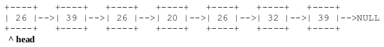
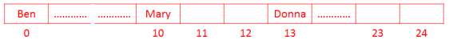
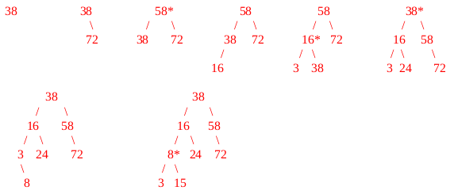

# Spring 2017

## Data Structures

### A 1: Dynamic Memory Management in C



#### 10 points

A catalogue of _apps_ and their price is stored in a text file. Each line of the file contains the name of an app \(1-19 letters\) followed by its price with a space in between. Write a function called `makeAppArray` that reads the _app information_ from the file and stores it in an array of app pointers. Your function should take 2 parameters: a pointer to the file containing the app information and an integer indicating the number of _**apps**_ in the file. It should return a pointer to the array of _**apps**_. An _**app**_ is stored in a struct as follows:

```c
typedef struct app
{
  char name[20];
  float price;
} app;
```

Make sure to allocate memory dynamically. The function signature is:

```c
app** makeAppArray(FILE* fp, int numApps)
{
  // your code
}
```



```c
app** makeAppArray(FILE* fp, int numApps)
{
  app** appArray = (app**)malloc(numApps * sizeof(app*)); // 3 pts
  int i;

  for(i=0; i < numApps; i++)
  {
    appArray[i] = (app*)malloc(sizeof(app));              // 2 pts
    fscanf(fp, "%s", appArray[i]->name);                  // 2 pts
    fscanf(fp, "%f", &(appArray[i]->price));              // 2 pts
  }

  return appArray;                                        // 1 pt
}
```

_**Grading notes: the casts aren't necessary, no points off for forgetting to declare i, no points off if only one percent code is wrong, 1 pt off if both percent codes are wrong, take only 1 pt off total if the syntax for reading from a file is incorrect, take off only 1 pt total if they use a dot instead of an array, they can order these statements differently - they can allocate ALL of the space before reading anything in.**_



### A 2: Linked Lists



#### 5 points

Consider the following function that takes in as a parameter a pointer to the front of a linked list\(list\) and the number of items in the list\(size\). _**node**_ is defined as follows:

```c
typedef struct node
{
  int data;
  struct node* next;
} node;

int mystery(node* list, int size)
{
  node* prev = list;
  node* temp = list->next;

  while (temp != NULL)
  {
    if (list->data == temp->data)
    {
      prev->next = temp->next;
      free(temp);
      size--;
      temp = prev->next;
    }
    else
    {
      prev = prev->next;
      temp = temp->next;
    }
  }

  return size;
}
```

If `mystery(head, 7)`, is called, where head is shown below, what will the function return and draw a picture of the resulting list, right after the call completes?



Adjusted List:

Return Value: **\_**



Adjusted List:


Return Value: 5

_**Grading: 2 pts return value \(all or nothing\), 3 pts list, give partial for list as you see fit.**_



### A 3: Queues



#### 10 points

A queue is implemented as an array. The queue has the 2 attributes, front and size. front is the index in the array where the next element to be removed from the queue can be found, if the queue is non-empty. \(If the queue is empty, front may be any valid array index from 0 to 19.\) size is the total number of elements currently in the queue. For efficient use of resources, elements can be added to the queue not just at the end of the array but also in the indices at the beginning of the array before front. Such a queue is called a circular queue. A circular queue has the following structure:

```c
typedef struct
{
  int values[20];
  int front, size;
} cQueue;
```

Write an enqueue function for this queue. If the queue is already full, return 0 and take no other action. If the queue isn't full, enqueue the integer item into the queue, make the necessary adjustments, and return 1. Since the array size is hard-coded to be 20 in the struct above, you may use this value in your code and assume that is the size of the array values inside the struct.

```c
int enqueue(cQueue* thisQ, int item)
{
  // your code
}
```



```c
int enqueue(cQueue* thisQ, int item)
{
  if (thisQ->size == 20)                                  // 2 pts
    return 0;                                             // 1 pt

  // 5 pts: 1 values, 3 pts index, 1 pt item
  thisQ->values[(thisQ->front+thisQ->size)%20] = item;

  thisQ->size++;                                          // 1 pt
  return 1;                                               // 1 pt
}
```

_**Grading notes: If they forget thisQ-&gt; each time, take off 2 pts total.**_



### B 1: Binary Trees



#### 10 points

Michael took CS 1 last semester. During the Winter break he thought that it would be cool to keep track of all of the new words that he learned while reading a novel. He has stored all of his words \(all 1-19 lowercase letters only\) in alphabetic order in a binary search tree \(BST\). The nodes of his BST are stored in the following structure:

```c
typedef struct
{
  struct node *left, *right;
  char word[20];
} bsNode;
```

Michael wants to count the number of words in his binary search tree that come before a specified word in alphabetical order. Write a _**recursive**_ function `countBefore` which takes in a pointer to the root of a binary search tree storing the words and a string `target` \(of 1-19 lowercase letters only\) and returns the number of words in the tree that _**come before**_ `target`, alphabetically.

```c
int countBefore(bsNode* root, char target[])
{
  // your code
}
```



```c
int countBefore(bsNode* root, char target[])
{
  if (root == NULL) return 0;                                     // 2 pts
  if (strcmp(target, root->word) <= 0)                            // 2 pts
    return countBefore(root->left);                               // 2 pts

  // 1 pt return, 1 pt 1, 1 pt left, 1 pt right
  return 1 + countBefore(root->left) + countBefore(root->right);
}
```



### B 2: Hash Maps



#### 5 points

**\(a\)** \(3 pts\) A set of students’ names are stored in a hash table implemented as an array of size 25. Their grades out of 100 are used as input to the hashing function. Suggest one hash function that can be used to store the names. Would your function cause clashes? Explain your answer.

**\(b\)** \(2 pts\) If the following students have the grades shown, and your hash function given in \(a\) is used, draw the state of the hash map after these 3 entries are inserted into the table. \(Note: No need to show all 25 array slots, just clearly label the index and contents of each of the non-empty array slots.\)

**Mary 60** **Ben 75** **Dona 13**



**\(a\)**

Hash function stores the student’s name in the array index score%25. Hashmap\[score%25\] = name score

**Grading: 2 pts, note, MANY answers are valid here!!!**

This function can cause collisions since 2 distinct scores can has to the same index or because two different students can earn the exact same score!

**Grading: 1 pt**

**\(b\)**

**Mary 60** **Ben 75** **Dona 13**



_**Grading: 2 pts for correct response \(BASED ON THEIR HASH FUNCTION\), 1 pt if some of their answer is correct**_



### B 3: AVL Trees



#### 10 points

**\(a\)** \(8 pts\) Create an AVL tree by inserting the following values in the order given: 38, 72, 58, 16, 3, 24, 8, and 15. Show the state of the tree after each insertion.

**\(b\)** \(2 pts\) Draw the state of the tree after the deletion of the node containing the value 16.



**\(a\)**

Note: it the solution below, rotations aren't shown, just the final answers after the appropriate rotations. Steps where rotations were necessary are marked with an astericks at the root of the rotation.



_**Grading: 1 pt for each tree, as long as the insertion on step k was of equal difficulty to the correct insertion, give the point as long as the insertion is correct based on their answer for step k-1.**_

**\(b\)**

There are two possible answers here. One may replace the 16 with either the 15 or 24 and then delete the physical node where the 15 or 24 was stored, respectively. The answer on the left is what occurs when we replace 16 with 15 and the answer on the right is what occurs when we replace 16 with 24:

_**Grading: 2 pts**_



## Algorithms and Analysis Tools

### A 1: Algorithm Analysis



#### 5 points







### A 2: Algorithm Analysis



#### 10 points







### A 3: Summations and Recurrence Relations



#### 10 points







### B 1: Recursive Coding



#### 10 points







### B 2: Sorting



#### 5 points







### B 3: Backtracking



#### 10 points







## PDF Files







