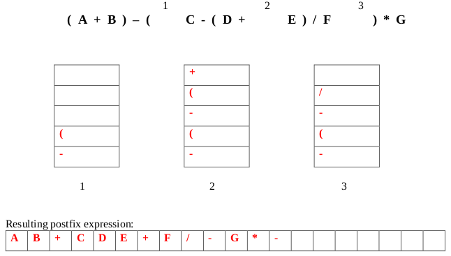
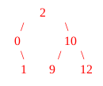
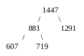
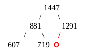
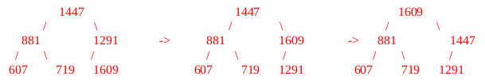
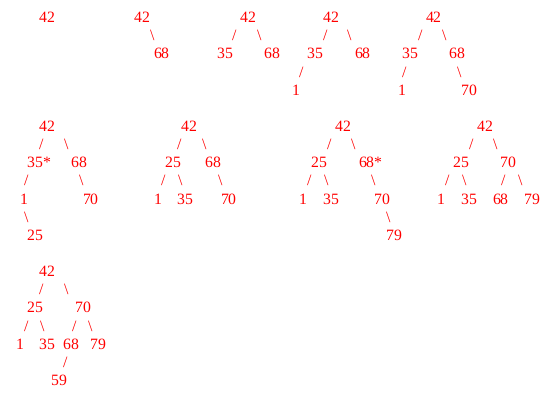
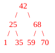

# Summer 2017

## Data Structures

### A 1: Dynamic Memory Management in C



#### 10 points

Suppose we would like to create an array to store our Must Watch TV list. Currently our list is stored in a text file with the name of each TV show on a line by itself. The name of each show consists of only letters and underscores and doesn't exceed 127 characters. Write a function called makeTVList that reads these names from a file, allocates memory dynamically to store the names, stores them in a two- dimensional character array and returns a pointer to that array. Your function should take 2 parameters: a pointer to the file and an integer indicating the number of TV shows in the file. It should return a pointer to the array of shows. Be sure to allocate memory for the array dynamically and only allocate as much space as is needed. Namely, do not allocate 128 characters to store each show name. Instead dynamically allocate an appropriate number of characters as necessary. Use any necessary functions from string.h.

```c
char ** makeTVList (FILE *ifp, int numShows)
{
  char buffer[128];
  char **TVList = NULL;
  int i;

  TVList = malloc(numShows * sizeof(char *));               // 2 pts

  for(i=0; i<numShows; i++)                                 // 1 pt
  {
    fscanf(ifp, “%s”, buffer);                              // 1 pt
    TVList[i] = malloc((strlen(buffer)+1)*(sizeof(char)));  // 3 pts
    strcpy(TVList[i], buffer);                              // 2 pts
  }

  return TVList;                                            // 1 pt
}
```



```c
char ** makeTVList (FILE *ifp, int numShows)
{
  char buffer[128];
  char **TVList = NULL;
  int i;
}
```



### A 2: Linked Lists



#### 10 points

Suppose we have a stack implemented as a linked list. The stack is considered “full” if it has 20 nodes and empty if the head pointer is NULL. The nodes of the stack have the following structure:

```c
typedef struct node
{
  int data;
  struct node* next;
} node;
```

Write a function to determine if the stack is full.

```c
int isFull(node *stack)
{
  // your code
}
```



```c
int isFull(node *stack)
{
  int count = 0;            // 1 pt initializing a counter
  node *helper = stack;

  if (stack == NULL)        // 2 pts checking if stack is null
    return 0; 

  while(helper != NULL)     // 2 pts iter linked list
  {
    count++;                // 1 pt incrementing counter
    helper = helper->next;  // 1 pt advancing node
  }                         // Note: can stop at 20...

  if (count >= 20)          // 2 pts returning true iff 20 or more
    return 1; 

  return 0;                 // 1 pt returning false if no

  // Note: return count >= 20; takes care of both...
}
```

Alternate solution.

```c
int isFull(node *stack)
{
  int i;                          // 1 pt

  for (i=0; i<20; i++)            // 2 pts
  {
    if (stack == NULL) return 0;  // 3 pts
    stack = stack->next;          // 2 pts
  }

  return 1;                       // 2 pts
}
```



### A 3: Stacks



#### 5 points

Convert the following infix expression to postfix using a stack. Show the contents of the stack at the indicated points \(1, 2, and 3\) in the infix expression.








_**Grading: 1 point for each stack, 2 points for the whole expression (partial credit allowed.)**_



### B 1: Binary Search Trees




#### 10 points
 
**(a)** (3 pts) Given the following traversals, draw the Binary Search Tree they represent.

Pre-Order: 2, 0, 1, 10, 9, 12
Post-Order: 1, 0, 9, 12, 10, 2
In-Order: 0, 1, 2, 9, 10, 12

**(b)** If the nodes of the BST have the following structure, construct a recursive function to count the number of nodes in the tree.

```c
typedef struct bstNode
{
  struct bstNode *left, *right;
  char word[20];
} bstNode;

int count(bstNode *root)
{
  // your code
}
```

**(c)** (2 pts) Write a single line of code calling the count function that assigns the number of nodes in the left subtree of the tree pointed to by a pointer `myTreePtr` to the integer variable `leftCount`. You may assume that `myTreePtr` is not pointing to NULL and points to an actual `bstNode`.





**(a)**



**_Grading: 1 pt placing 2 at the root, 1 pt left subtree, 1 pt right subtree_**

**(b)**

```c
typedef struct bstNode
{
  struct bstNode *left, *right;
  char word[20];
} bstNode;

int count(bstNode *root)
{
  if (root == NULL) return 0;                         // 2 pts
  
  // 1 pt 1, 1 pt left, 1 pt right
  return 1 + count(root->left) + count(root->right);
}
```

**(c)**

```c
int leftCount = count(myTreePtr->left);   // 2 pts
```




### B 2: Heaps




#### 5 points

**(a)** (1 pts) In her computer science courses, Maria has learned some interesting things about prime numbers and data structures. She has decided to store some prime numbers in a Max-Heap using the tree representation of heaps. If Maria has stored 125 prime numbers, how tall would the Heap be?

**(b)** (2 pts) Here is the Max-Heap after 5 insertions. Clearly draw a circle in the location where the next prime will initially be inserted. Also draw a pointer from the parent of this node initially and clearly indicate whether or not the pointer is a left or right pointer.



**(c)** (2 pts) Show each step of inserting 1609 into the Max-Heap from part (b). Please draw a different picture for each of the different positions 1609 will be in the heap.





**(a)**

Height = 6

Heaps are complete binary trees, so the height is determined by ⌊log 2 125⌋. You can also add the “levels” of the tree: 1 + 2 + 4 + 8 + 16 + 32 + 62.

**_Grading: 1 pt all or nothing_**

**(b)**



The next node must be added as the left child of 1291.

**_Grading: 2 pts all or nothing_**

**(c)**



Students should show both percolate up steps for 1609. 1 point per step. If they don't show the middle step and just have the final picture with 1609 as the root, award 1 point out of 2.




### B 3: AVL Trees




#### 10 points

**(a)** (8 pts) Create an AVL tree by inserting the following values in the order given: 42, 68, 35, 1, 70, 25, 79, and 59. Show the state of the tree after each insertion. Draw a box around each of these 8 trees.

**(b)** (2 pts) Draw the state of the tree after the deletion of the node containing the value 79 from the tree at the end of part (a).





**(a)**



**_Grading: Students should show each insertion step for 1 pt each. Imbalances should be detected and corrected for after inserting 25 and after inserting 79; detected at 35 and 68 respectively._**

**(b)**



**_Grading: Deleting 79 creates an imbalance at 70 that must be corrected._**




## Algorithms and Analysis Tools

### A 1: Algorithm Analysis



#### 10 points







### A 2: Algorithm Analysis



#### 5 points







### A 3: Summations and Recurrence Relations



#### 10 points







### B 1: Recursive Coding



#### 5 points







### B 2: Sorting



#### 10 points







### B 3: Backtracking



#### 10 points







## PDF Files







