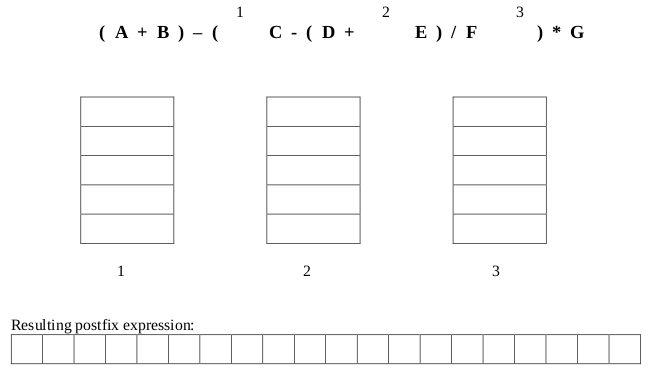

# Summer 2017

## Data Structures

### A 1: Dynamic Memory Management in C



#### 10 points

Suppose we would like to create an array to store our Must Watch TV list. Currently our list is stored in a text file with the name of each TV show on a line by itself. The name of each show consists of only letters and underscores and doesn't exceed 127 characters. Write a function called makeTVList that reads these names from a file, allocates memory dynamically to store the names, stores them in a two- dimensional character array and returns a pointer to that array. Your function should take 2 parameters: a pointer to the file and an integer indicating the number of TV shows in the file. It should return a pointer to the array of shows. Be sure to allocate memory for the array dynamically and only allocate as much space as is needed. Namely, do not allocate 128 characters to store each show name. Instead dynamically allocate an appropriate number of characters as necessary. Use any necessary functions from string.h.

```c
char ** makeTVList (FILE *ifp, int numShows)
{
  char buffer[128];
  char **TVList = NULL;
  int i;

  TVList = malloc(numShows * sizeof(char *));               // 2 pts

  for(i=0; i<numShows; i++)                                 // 1 pt
  {
    fscanf(ifp, “%s”, buffer);                              // 1 pt
    TVList[i] = malloc((strlen(buffer)+1)*(sizeof(char)));  // 3 pts
    strcpy(TVList[i], buffer);                              // 2 pts
  }

  return TVList;                                            // 1 pt
}
```



```c
char ** makeTVList (FILE *ifp, int numShows)
{
  char buffer[128];
  char **TVList = NULL;
  int i;
}
```



### A 2: Linked Lists



#### 10 points

Suppose we have a stack implemented as a linked list. The stack is considered “full” if it has 20 nodes and empty if the head pointer is NULL. The nodes of the stack have the following structure:

```c
typedef struct node
{
  int data;
  struct node* next;
} node;
```

Write a function to determine if the stack is full.

```c
int isFull(node *stack)
{
  // your code
}
```



```c
int isFull(node *stack)
{
  int count = 0;            // 1 pt initializing a counter
  node *helper = stack;

  if (stack == NULL)        // 2 pts checking if stack is null
    return 0; 

  while(helper != NULL)     // 2 pts iter linked list
  {
    count++;                // 1 pt incrementing counter
    helper = helper->next;  // 1 pt advancing node
  }                         // Note: can stop at 20...

  if (count >= 20)          // 2 pts returning true iff 20 or more
    return 1; 

  return 0;                 // 1 pt returning false if no

  // Note: return count >= 20; takes care of both...
}
```

Alternate solution.

```c
int isFull(node *stack)
{
  int i;                          // 1 pt

  for (i=0; i<20; i++)            // 2 pts
  {
    if (stack == NULL) return 0;  // 3 pts
    stack = stack->next;          // 2 pts
  }

  return 1;                       // 2 pts
}
```



### A 3: Stacks



#### 5 points

Convert the following infix expression to postfix using a stack. Show the contents of the stack at the indicated points \(1, 2, and 3\) in the infix expression.







_**Grading: 1 point for each stack, 2 points for the whole expression \(partial credit allowed.\)**_



### B 1: Binary Search Trees



#### 10 points







### B 2: Heaps



#### 5 points







### B 3: AVL Trees



#### 10 points







## Algorithms and Analysis Tools

### A 1: Algorithm Analysis



#### 10 points







### A 2: Algorithm Analysis



#### 5 points







### A 3: Summations and Recurrence Relations



#### 10 points







### B 1: Recursive Coding



#### 5 points







### B 2: Sorting



#### 10 points







### B 3: Backtracking



#### 10 points







## PDF Files







