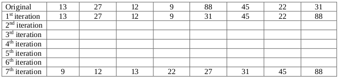
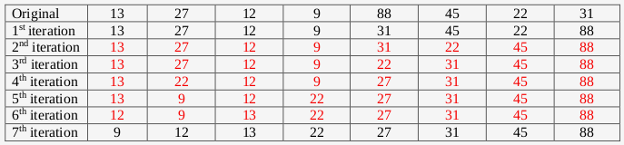
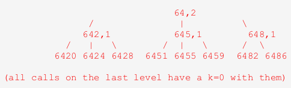

# Fall 2018

## Data Structures

### A 1: Dynamic Memory Management in C



#### 10 points

Consider allocating space for an array of arrays, where each of the individual lengths of the different one dimensional arrays may differ. For example, we might want 5 arrays, which have lengths 10, 5, 20, 100 and 50, respectively. Write a function `makeArray` that takes in an array of integers itself and the length of that array \(so for the example above the first parameter would be the array storing 10, 5, 20, 100 and 50 and the second parameter would have a value of 5\) and allocates space for an array of arrays where each of the individual arrays have the lengths specified by the values of the input array. Before returning a pointer to the array of arrays, the function should store 0 in every element of every array allocated.

```c
int** makeArray(int* lengths, int numarrays)
{
  // your code
}
```



```c
int** makeArray(int* lengths, int numarrays)
{
  int** array = malloc(sizeof(int*)*numarrays);
  int i;

  for (i=0; i<numarrays; i++)
    array[i] = calloc(lengths[i], sizeof(int));

  return array; 
}
```

_**Grading:**_

* 3 pts initial malloc, \(1 pt for _\*, 1 pt for sizeof\(int_\), 1 pt \*numarrays\) could use calloc as well.
* 2 pts for loop
* 4 pts for allocating each array \(2 pts\) and zeroing it out \(2 pts\), obviously calloc does this faster, but you can also malloc and run a loop inside a loop...
* 1 pt for the return



### A 2: Linked Lists



#### 10 points

Consider storing an integer in a linked list by storing one digit in each node where the one’s digit is stored in the first node, the ten’s digit is stored in the second node, and so forth. Write a _**recursive function**_ that takes in a pointer to the head of a linked list storing an integer in this fashion and returns the value of the integer. Assume that the linked list has 9 or fewer nodes, so that the computation will not cause any integer overflows. \(For example, 295 would be stored as 5 followed by 9 followed by 2.\) Use the struct shown below:

```c
typedef struct node
{
  int data;
  struct node* next;
} node;

int getValue(node *head)
{
  // your code
}
```



```c
typedef struct node
{
  int data;
  struct node* next;
} node;

int getValue(node *head)
{
  if (head == NULL)
    return 0;

  return head->data + 10*getValue(head->next);
}
```

**Grading:**

* 2 pts check head == NULL
* 1 pt ret 0 \(give full credit if base case is LL size 1\)
* 1 pt return
* 1 pt access head-&gt;data
* 1 pt add
* 1 pt 10\*
* 1 pt rec call
* 2 pts parameter



### A 3: Stacks/Queues



#### 5 points

Consider modeling cars lining up at a traffic light in a simulation. Would it be better to utilize a stack in the simulation or a queue, to store the cars? Clearly explain your choice.



A queue would be better. At a standard traffic light, the earlier a car gets to the light, the earlier the car gets to go through the light. Traffic works in this "fair" way - first in, first out.

In thinking about designing this system, we would have each road coming into a traffic light stored as a queue. If a particular light changes from red to green at some point in time, then the cars would get dequeued from that road/light pair and each one would potentially get enqueued into the next queue representing the road/light pair they were traveling to next. A good simulation would be able to handle some of this movement in parallel, carefully keeping track of time and would identify areas of bottlenecks. Namely, if a queue fills up and another car wants to enter the queue, it actually won't get to do so, since it'll get stuck at the previous light, even though it's green! \(More than likely all UCF students who drive cars on campus have experienced this wonderful phenomenon.\)

_**Grading: 0 pts if the answer is stack. 2 pts for saying queue, 3 pts for the explanation. The explanation can be as brief as the second sentence in this solution. The second paragraph is further explanation not required for full credit.**_



### B 1: Binary Search Trees



#### 10 points

Complete writing the function shown below _**recursively**_, so that it takes in a pointer to the root of a binary search tree of strings, _root_, and a string, _target_, and returns 1 if the string is contained in the binary search tree and false otherwise. You may assume all strings stored in the tree contain lowercase letters only. In order to receive full credit, your function must run in O\(h\) time, where h is the height of the binary search tree storing all of the words.

```c
typedef struct bstNode
{
  struct bstNode *left, *right;
  char str[100];
} bstNode;

int search(bstNode *root, char* target)
{
  // your code
}
```



```c
typedef struct bstNode
{
  struct bstNode *left, *right;
  char str[100];
} bstNode;

int search(bstNode *root, char* target)
{
  if (root == NULL) return 0;             // 2 pts
  int cmp = strcmp(target, root->str);  

  if (cmp < 0)                            // 1 pt
    return search(root->left, target);    // 2 pts
  else if (cmp > 0)                       // 1 pt
    return search(root->right, target);   // 2 pts

  return 1;                               // 2 pts
}
```



### B 2: Hash Tables



#### 5 points

There are two hash functions that take in strings as input shown below. Each returns an integer in between 0 and 1,000,002. \(Note: 1,000,003 is a prime number.\) Which of these two is a better hash function? Explain the weakness in the other function.

```c
int f1(char* str)
{
  int i = 0, res = 0;

  while (str[i] != ‘\0’)
  {
    res = (256*res + (int)(str[i]))%1000003;
    i++;
  }

  return res;
}

int f2(char* str)
{
  int i = 0, res = 0;

  while (str[i] != ‘\0’)
  {
    res = (res + (int)(str[i]))%1000003;
    i++;
  }

  return res;
}
```



The better function is f1. This function is expressing the string in base 256, mod 1000003. The other function, f2, is simply adding the Ascii values of the individual characters of the string mod 1000003. One reason this is problematic is that the sum of the Ascii values of most strings tends to be pretty small. Each individual value is near 100 and most everyday strings have no more than 12 or 13 letters. So the probability of getting a hash value less than 1200 is extremely high and the probability of getting a hash value in between 1200 and 1,000,002 is extremely low. A good hash function has a roughly equal probability that any of the hash values will be generated on an arbitrary input. Secondly, any strings that are anagrams of one another are definitively going to create a collision, since order of the characters in a string doesn't at all affect the hash function value returned by f2. Good hash functions are such that there's no formulaic way to create two different inputs that map to the same output in a reliable way.

_**Grading: There is no need to have the depth of this response for full credit. Give 2 pts for answering that f1 is better, and upto 3 pts for the flaws of f2. Any cogent response which explains why the hash values are unlikely to be equally distributed should get full credit. Decide partial as necessary. Max score for those who pick f2 is 1 out of 5.**_



### B 3: Tries



#### 10 points

The word “intention” is such that four of its prefixes, “i”, “in”, “intent” and “intention” are words themselves. Write a function that takes in a pointer to the root of a trie storing a dictionary of words and returns the maximum number of words that are prefixes of a single word. Use the struct definition and function prototype given below.

```c
typedef struct TrieNode
{
  struct TrieNode *children[26];
  int flag; // 1 if the string is in the trie, 0 otherwise
} TrieNode;

int maxNumPrefixWords(TrieNode* root)
{
  // your code
}
```



```c
typedef struct TrieNode
{
  struct TrieNode *children[26];
  int flag; // 1 if the string is in the trie, 0 otherwise
} TrieNode;

int maxNumPrefixWords(TrieNode* root)
{
  if (root == NULL) return 0;                                       // 2 pts
  int maxChild = 0;
  int i;

  for (i=0; i<26; i++)                                              // 2 pts
    maxChild = max(maxChild, maxNumPrefixWords(root->children[i]));
    // 4 pts, 3 pts for rec call, 1 for updating max

  return maxChild + root->flag;                                     // 2 pts
}
```



## Algorithms and Analysis Tools

### A 1: Algorithm Analysis



#### 10 points







### A 2: Algorithm Analysis



#### 5 points







### A 3: Recurrence Relations



#### 10 points







### B 1: Recursive Coding



#### 10 points

The code below returns the number of zeros at the end of n!

```c
int zeros(int n) {
  int res = 0;
  while (n != 0) {
    res += n/5;
    n /= 5;
  }
  return res;
}
```

Rewrite this method _**recursively**_:

```c
int zeros(int n)
{
  // your code
}
```



```c
int zeros(int n)
{
  if (n == 0) return 0;         // 2 pts if n==0, 1 pt ret 0
  return n/5 + zeros(n/5);      // 1 pt return, 2 pts n/5, 1 pt +
                                // 1 pt rec call, 2 pts n/5.
}
```



### B 2: Sorting



#### 5 points

Show the state of the array below for each iteration of _**selection sort**_:







_**Grading: 1 pt per row, row has to be perfect to get the point for that row**_



### B 3: Backtracking



#### 10 points

We define a number as Digit Sum Divisible if, for each value of i, the sum of its first i digits is divisible by i. For example, the number 6451 is Digit Sum Divisible because 6 is divisible by 1, 6 + 4 = 10 is divisible by 2, 6 + 4 + 5 = 15 is divisible by 3 and 6 + 4 + 5 + 1 = 16 is divisible by 4. Consider writing a backtracking function that outputs all Digit Sum Divisible numbers of a particular length given a particular prefix. This function would take in a prefix, such as “64” and a number of digits left to add to it \(for this example, 2\), and the function would print out each Digit Sum Divisible number starting with the digits 64 that are four digits long. The function would use backtracking because instead of adding each possible digit to the given prefix and making a recursive call, it would first check to see if doing so would maintain the divisibility requirement for the next length. \(In this example, 640 would be skipped since 6 + 4 + 0 = 10 and 10 isn’t divisible by 3.\) _**Write out a tree structure that shows each unique prefix that occurs for each recursive call for the specific function call with the prefix 64 and 2 digits left to add to it**_. \(Note: The root node of your tree should be 64, each child of 64 should be a three digit number, and each child of those children should have a four digit number. There should be eight leaf nodes in the tree, so make sure to leave enough room for eight nodes at the bottom level. These leaf nodes are the eight numbers the function would print out for this specific call.\) **Note: Please do NOT write any code for this problem, just write out the underlined specified task above.**





_**Grading: 1 pt for level 0, 1 pt for level 1, 1 pt for each item in level 2. If extra items are included, subtract 1, cap at 0. Note: No need to add the value of k for each recursive call in the tree. They are printed in this solution for clarity's sake.**_



## PDF Files







