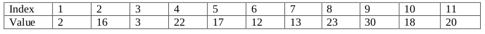
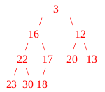
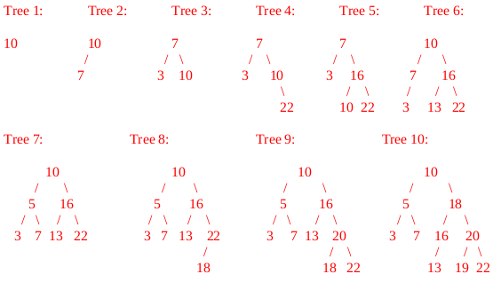

# Spring 2018

## Data Structures

### A 1: Dynamic Memory Management in C



#### 10 points

The struct, `dataTOD`, shown below, is used to collect data from different devices connected to the CPU. Every time the data is updated a new buffer containing the structure’s data is created and populated.

```c
typedef struct dataTOD
{
  int seconds;      // seconds since midnight
  double data;      // data sample
  char * dataName;  // data name (optional)
} dataTOD;
```

**\(a\)** \(8 pts\) Write the code necessary to create and initialize the members of `dataTOD` in a function named `init_dataTOD` that returns a pointer to the newly created buffer. Return NULL in the event a buffer cannot be created. Otherwise, set the seconds and data values according to the corresponding input parameters to `init_dataTOD`, dynamically allocate the proper space for dataName and then copy the contents of name into it \(not a pointer copy\) and a return a pointer to the newly created struct.

```c
dataTOD * init_dataTOD(int sec, double val, char* name)
{
  // your code
}
```

**\(b\)** \(2 pts\) Complete the function below so that it frees all the dynamically allocated memory pointed to by its formal parameter zapThis. You may assume that the pointer itself is pointing to a valid struct and its dataName pointer is pointing to a dynamically allocated character array.

```c
void free_dataTOD(dataTOD *zapThis)
{
  // your code
}
```



**\(a\)**

```c
dataTOD * init_dataTOD(int sec, double val, char* name)
{
  dataTOD * tDta = malloc(sizeof(dataTOD));

  if (tDta == NULL)
    return NULL;

  tDta->seconds = sec;
  tDta->data = val;
  tDta->dataName = malloc((strlen(name)+1)*sizeof(char));
  strcpy(tDta->dataName, name);
  return tDta;
}
```

_**Grading: 1 point for each line shown above. Assign partial if necessary but assign a whole number of points.**_

**\(b\)** \(2 pts\) Complete the function below so that it frees all the dynamically allocated memory pointed to by its formal parameter zapThis. You may assume that the pointer itself is pointing to a valid struct and its dataName pointer is pointing to a dynamically allocated character array.

```c
void free_dataTOD(dataTOD *zapThis)
{
  free(zapThis->dataName);
  free(zapThis);  
}
```

_**Grading: 1 pt each line**_



### A 2: Linked Lists



#### 5 points

Given the linked list structure named node, defined in lines 1 through 4, and the function named `eFunction` defined in lines 6 through 14, answer the questions below.

```c
typedef struct node
{
  int data;
  struct node * next;
} node;

node* eFunction(node* aNode)
{
  if(aNode == NULL) return NULL;
  if(aNode->next == NULL) return aNode;

  node* rest = eFunction(aNode->next);
  aNode->next->next = aNode;
  aNode->next = NULL;
  return rest;
}
```

**\(a\)** \(1 pt\) Is this function recursive? \(Circle the correct answer.\) YES NO

**\(b\)** \(2 pts\) What does the function eFunction do, in general to the list pointed to by its formal parameter, aNode?

**\(c\)** \(2 pts\) What important task does line 14 perform?



**\(a\)** YES

_**Grading: 1 pt**_

**\(b\)** This function reverses the list originally pointed to by aNode and returns a pointer to the new front of the list.

_**Grading: 1 pt for reverse, 1 pt for return pointer to reversed list.**_

**\(c\)** The last node in a linked list must have its next pointer point to NULL. That is how most linked list functions detect the end of the list. Line 12 does this since aNode ends up point to the last node in the list. After the reversal is complete, it's necessary to make sure that the next pointer of the last node in the resulting list is pointing to NULL because before line 12 it's not. \(It's pointing to the second node in the original list, which is the last node in the list pointed to by rest.\)

_**Grading: Most of this detail is unnecessary. Full credit for noting that the line sets the last node's next pointer of the resulting list to NULL. Give partial as needed.**_



### A 3: Stacks



#### 10 points

Consider evaluating a postfix expression that only contained positive integer operands and the addition and subtraction operators. \(Thus, there are no issues with order of operations!\) Write a function that evalulates such an expression. To make this question easier, assume that your function takes an array of integers, expr, storing the expression and the length of that array, len. In the array of integers, all positive integers are operands while -1 represents an addition sign and -2 represents a subtraction sign. Assume that you have a stack at your disposal with the following function signatures. Furthermore, assume that the input expression is a valid postfix expression, so you don't have to ever check if you are attempting to pop an empty stack. Complete the evaluate function below.

```c
void init(stack* s);            // Initializes the stack pointed to by s.
void push(stack* s, int item);  // Pushes item onto the stack pointed to by s.
int pop(stack* s);              // Pops and returns the top value from the stack
                                // pointed to by s.

int eval(int* expr, int len)
{
  stack s;
  init(&s);
  int i;
}
```



```c
void init(stack* s);            // Initializes the stack pointed to by s.
void push(stack* s, int item);  // Pushes item onto the stack pointed to by s.
int pop(stack* s);              // Pops and returns the top value from the stack
                                // pointed to by s.

int eval(int* expr, int len)
{
  stack s;
  init(&s);
  int i;

  for (i=0; i<len; i++)     // 1 pt
  {
    if (expr[i] > 0)        // 1 pt
      push(&s, expr[i]);    // 1 pt
    else
    {
      int op2 = pop(&s);    // 1 pt
      int op1 = pop(&s);    // 1 pt

      if (expr[i] == -1)    // 1 pt
        push(&s, op1+op2);  // 1 pt
      else
        push(&s, op1-op2);  // 2 pts (1 pt for order)
    }
  } 

  return pop(&s);           // 1 pt
}
```



### B 1: Binary Search Trees



#### 10 points

Write a _**recursive**_ function to find the _**leaf node**_ in a binary search tree storing the minimum value. \(Thus, of all leaf nodes in the binary search tree, the function must return a pointer to the one that stores the smallest value.\) If the pointer passed to the function is NULL \(empty tree\), the function should return NULL.

```c
typedef struct bstNode
{
  int data;
  struct bstNode *left;
  struct bstNode *right;
} bstNode;

bstNode* find_min_leaf(bstNode* root)
{
  // your code
}
```



```c
typedef struct bstNode
{
  int data;
  struct bstNode *left;
  struct bstNode *right;
} bstNode;

bstNode* find_min_leaf(bstNode* root)
{
  if (root == NULL)                               // 1 pt
    return NULL;                                  // 1 pt

  if (root->left == NULL && root->right == NULL)  // 2 pts
    return root;                                  // 1 pt

  if (root->left != NULL)                         // 1 pt
    return find_min_left(root->left);             // 2 pts

  return find_min_left(root->right);              // 2 pts
}
```



### B 2: Binary Heaps



#### 5 points

The array below stores a minimum binary heap. Draw the tree version of the corresponding binary heap. Then, remove the minimum value and show the resulting heap, in tree form. \(Note: Index 0 isn't shown because index 1 stores the value at the root/top of heap.\)





Here is the initial heap, in tree form:


When we delete the minimum, 2, stored at the top, 20, the value in the "last" location replaces it \(to maintain the structural integrity of the heap.\) From there, we percolate 20 down, swapping it with 3, and then 12 to get the resulting tree:



**Grading**

* 2 pts for correct drawing, 1 pt is something minor is off, 0 otherwise.
* 1 pt if structural location of 20 is removed, 1 pt for incorrect percolateDown,
* 2 pts for correct percolateDown. \(If the drawing is significantly wrong, don't give any credit for the second part. If it's slightly wrong, map points as best as possible.\)



### B 3: AVL Trees



#### 10 points

Show the result of inserting the following values into an initially empty AVL tree:

10, 7, 3, 22, 16, 13, 5, 18, 20 and 19.

Draw a box around your result _**after each insertion**_.



The resulting trees are as follows:



_**Grading: 1 pt per tree, try to judge each insertion based on their previous tree \(so they can get a point even if their answer doesn't match as long as it is correct based on their previous tree.\)**_



## Algorithms and Analysis Tools

### A 1: Algorithm Analysis



#### 10 points







### A 2: Algorithm Analysis



#### 5 points







### A 3: Summations and Recurrence Relations



#### 10 points







### B 1: Recursive Coding



#### 10 points

Write an _**efficient recursive**_ function that takes in a _**sorted**_ array `numbers`, two integers, `low` and `high`, representing indexes into the array, and another integer, `value`, and returns the index in the array where `value` is found in the array in between index `low` and `high`, inclusive. If value is NOT found in the array in between indexes `low` and `high`, inclusive, then the function should return -1.

```c
int search(int numbers[], int low, int high, int value)
{
  // your code
}
```



```c
int search(int numbers[], int low, int high, int value)
{
  if (low > high) return -1;
    int mid = (low+high)/2;

  if (value > numbers[mid])
    return search(numbers, mid+1, high, value);
  else if (value < numbers[mid])
    return search(numbers, low, mid-1, value);
  else
    return mid;
}
```

**Grading**:

* 2 pts for return -1 base case
* 3 pts for going halfway in between search range
* 2 pts for case going to the right
* 2 pts for case going to the left
* 1 pt for base case returning mid
* Max grade of 7 for linear recursive solution \(no pts for going halfway...\)
* Max grade of 3 pts for non-recursive solution, regardless of runtime.
* Max grade of 6 if recursive structure is correct but recursive call\(s\) are missing



### B 2: Sorting



#### 5 points

\(a\) \(3 pts\) Explain why, in the worst case, Quick Sort runs more slowly than Merge Sort.

In the worst case for Quick Sort, every time the array get split into two sides, if the split is extremely unequal \(0 items on one size and all n-1 items except the partition element on the other side\), worst case behavior occurs because there are n nested recursive calls on arrays of size n, n-1, n-2, and so forth.

In Merge Sort, it's guaranteed that the recursive calls always split into two arrays of roughly equal size. In general, the more equal the split between the two recursive calls is, the better the overall run-time will be. Because the Merge Sort split is essentially fixed, its worst case run time is near equal to its average case run time. But for Quick Sort, since this split at each level of recursion can be arbitrarily unequal, in the worst case where it's extremely unequal, the sort performs worse than Merge Sort.

_**Grading: The amount of detail above isn't necessary. Full credit to any response that recognizes that when making two recursive calls it's better to split the input array equally and that Merge Sort guarantees this but for Quick Sort this doesn't happen in the worst case. Award partial credit as you see fit.**_

\(b\) \(2 pts\) In practice, Quick Sort runs slightly faster than Merge Sort. This is because the partition function can be run "in place" while the merge function can not. More clearly explain what it means to run the partition function "in place".

To run the partition function in place means that the function doesn't have to allocate significant extra memory other than the original array to sort that is passed to it. In particular, only a single temporary extra variable is needed to perform swapping \(along with the usual loop index variables\). Otherwise, most of the work occurs within the already allocated memory of the array passed to the partition function.

The merge function allocates a new array such that values from the original array are copied into the newly allocated array, then copied back to the original array. Thus, this function doesn't run in place as it routinely allocates a linear amount of memory \(in the size of the arrays its merging\) to perform its tasks. This runs slower in practice because of the extra copy back step, even though Merge Sort splits its data in the recursive step in a more equitable \(and better\) fashion.

_**Grading: Again, the amount of detail written above isn't necessary. Give full credit for any response that simply says that "in place" means performing the task without extra memory, \(or a constant amount of extra memory.\) Award partial credit as you see fit.**_







### B 3: Backtracking



#### 10 points

Consider the problem of placing 8 kings on an 8 x 8 chessboard, so that no two of the kings can attack each other _**AND no two kings are on the same row or column**_. \(Recall that a King can move one space in each of the eight possible directions of movement: up, down, left, right or any of the four diagonals.\) Complete the code skeleton below so that it prints out each solution to the 8 Kings problem. \(Note: assume that the function print, which isn't included, prints out the solution that corresponds to a particular permutation of kings. For example, the permutation {2, 4, 6, 1, 3, 5, 7, 0} represents kings at the following locations \(0, 2\), \(1, 4\), \(2, 6\), \(3, 1\), \(4, 3\), \(5, 5\), \(6, 7\), and \(7, 0\).\)

```c
#include <stdio.h>
#include <math.h>
#define SIZE 8
void go(int perm[], int k, int used[]);
void print(int perm[]);
int main() {
  int perm[SIZE];
  int used[SIZE];
  int i;
  for (i=0; i<SIZE; i++) used[i] = 0;
  go(perm, 0, used);
  return 0;
}

void go(int perm[], int k, int used[]) {
  if ( _________________ ) {
    print(perm);
    return;
  }

  int i;
  for (i=0; i<SIZE; i++) {
    if ( ___________________________________ ) continue;
    if ( ___________________________________ ) continue;
    perm[k] = ____ ;
    used[ _____ ] = 1 ;
    go(perm, _______, used);
    used[ i ] = ___ ;
  }
}
```



```c
#include <stdio.h>
#include <math.h>
#define SIZE 8
void go(int perm[], int k, int used[]);
void print(int perm[]);
int main() {
  int perm[SIZE];
  int used[SIZE];
  int i;
  for (i=0; i<SIZE; i++) used[i] = 0;
  go(perm, 0, used);
  return 0;
}

void go(int perm[], int k, int used[]) {
  if ( k == SIZE ) {                                      // 1 pt
    print(perm);
    return;
  }

  int i;
  for (i=0; i<SIZE; i++) {
    if ( k > 0 && abs(i-perm[k-1]) <= 1 ) continue;       // 4 pts
    if ( used[i] ) continue;                              // 1 pt
    perm[k] = i ;                                         // 1 pt
    used[ i ] = 1 ;                                       // 1 pt
    go(perm, k + 1, used);                                // 1 pt
    used[ i ] = 0 ;                                       // 1 pt
  }
}
```



## PDF Files







