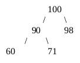
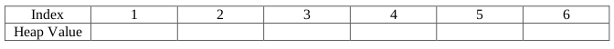
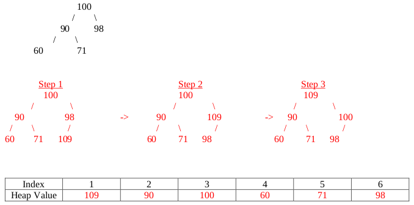
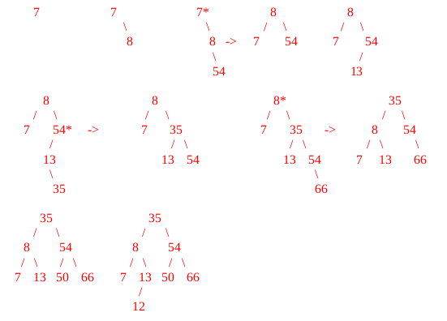
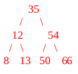

# Summer 2018

## Data Structures

### A 1: Dynamic Memory Management in C



#### 5 points

Suppose we have an array of structures containing information about our group for a group project. Each index should contain a group member’s name and phone number. The structure is shown below: names are stored as dynamically allocated strings and phone numbers are stored as integers. When the semester is over, we will delete this array. Write a function called deleteGroup that will take in this array and delete all the information, freeing all the memory space that the array previously took up. Your function should take 2 parameters: a pointer to the beginning of the array and an integer indicating the number of group members. It should return a null pointer representing the now empty array.

```c
typedef struct GroupMember
{
  char *name;
  int phoneNumber;
} GroupMember;

GroupMember* deleteGroup (GroupMember *group, int numMembers)
{
  int i;

  // your code
}
```



```c
typedef struct GroupMember
{
  char *name;
  int phoneNumber;
} GroupMember;

GroupMember* deleteGroup (GroupMember *group, int numMembers)
{
  int i;

  for(i=0; i<numMembers; i++) // 1 pt
    free(group[i].name);      // 2 pts

  free(group);                // 1 pt

  return NULL;                // 1 pt
}
```



### A 2: Linked Lists



#### 10 points

Suppose we have a linked list implemented with the structure below. Write a function that will take in a pointer to the head of a list and inserts a node storing -1 _**after**_ each even value in the list. If the list is empty or there are no even values in the list, no modifications should be made to the list. \(For example, if the initial list had 2, 6, 7, 1, 3, and 8, the resulting list would have 2, -1, 6, -1, 7, 1, 8, -1.\)

```c
typedef struct node
{
  int data;
  struct node* next;
} node;

void markEven(node *head)
{
  // your code
}
```



```c
typedef struct node
{
  int data;
  struct node* next;
} node;

void markEven(node *head)
{
  node* tmp = head;

  while (tmp != NULL)                         // 2 pts iter whole list
  {
    while (tmp != NULL && tmp->data%2 != 0)   // 3 pts find next even
      tmp = tmp->next;

    if (tmp != NULL)                          // 1 pt no null error
    {
      node* newnode = malloc(sizeof(node));
      newnode->data = -1;                     // 2 pts make new node
      newnode->next = tmp->next;              // 2 pts patch it into list
      tmp->next = newnode;
      tmp = newnode;
    }
  }
}
```



### A 3: Stacks



#### 10 points

**\(a\)** \(6 pts\) Convert the following infix expression to postfix using a stack. Show the contents of the stack at the indicated points \(1, 2, and 3\) in the infix expression.


**\(b\)** \(4 pts\) Whenever a recursive function is called, the function calls go onto a call stack. The depth of the call stack is the number of different recursive calls on the stack at a particular point in time, which indicates the number of different recursive calls that have started, but have not completed. What is the maximum stack depth of the call stack when the function fib\(10\) is executed? Is this maximum stack depth equal to the number of times the recursive function, fib, is called? Assume the implementation of the Fibonacci function shown below:

```c
int fib(int n)
{
  if (n < 2) return n;
  return fib(n-1) + fib(n-2);
}
```

Maximum Stack Depth: _\*\*\_\_\*\*\_

Is Max Stack Depth equal to the \# of recursive calls? YES NO \(Circle the correct answer.\)



**\(a\)**


_**Grading: 1 point for each stack, 3 points for the whole expression \(partial credit allowed.\)**_

**\(b\)**

```c
int fib(int n)
{
  if (n < 2) return n;
  return fib(n-1) + fib(n-2);
}
```

Maximum Stack Depth: 10

_**Grading: 2 pts for 10 or 9, 1 pt to be within 3, 0 pts otherwise**_

Is Max Stack Depth equal to the \# of recursive calls?: NO

_**Grading: 2 pts correct, 0 otherwise**_



### B 1: Binary Search Trees



#### 10 points

Complete writing function shown below _**recursively**_, so that it takes in a pointer to the root of a binary search tree, _root_, and an integer, _value_, and returns the number of nodes in the tree that are divisible by _value_. The struct used to store a node is shown below.

```c
typedef struct bstNode
{
  struct bstNode *left, *right;
  int data;
} bstNode;

int countDiv(bstNode *root, int value)
{
  // your code
}
```



```c
typedef struct bstNode
{
  struct bstNode *left, *right;
  int data;
} bstNode;

int countDiv(bstNode *root, int value)
{
  if (root == NULL) return 0;               // 2 pts

  // 4 pts, 2 pts for each recursive call.
  int res = countDiv(root->left, value) + countDiv(root->right, value);

  // 2 pts for checking divisibility, 1 pt for adding 1
  if (root->data % value == 0)
    res++;

  // 1 pt for returning.
  return res;
}
```



### B 2: Heaps



#### 5 points



Insert 109 Step 1:

Insert 109 Step 2:

Insert 109 Step 3:







_**Grading: 1 pt for each drawing, 2 pts for correct array, 1 pt for minor error in the array, 0 pt for major error in array.**_



### B 3: AVL Trees



#### 10 points

**\(a\)**



_**Grading: Students should show each insertion step for 1 pt each. Imbalances should be detected and corrected for after inserting 54, 35, and 66; detected at 7, 54, and 8 respectively.**_

**\(b\)**



Deleting 7 creates an imbalance at 8 that must be corrected.

_**Grading: 1 pt for a valid BST without 7, 1 pt for it being the correct BST without 7 \(0 pts if either 7 is still in it or it's not a valid BST.\)**_







## Algorithms and Analysis Tools

### A 1: Algorithm Analysis



#### 10 points







### A 2: Algorithm Analysis



#### 5 points







### A 3: Summations



#### 10 points







### B 1: Recursive Coding



#### 10 points







### B 2: Sorting



#### 10 points







### B 3: Bitwise Operators



#### 5 points







## PDF Files







