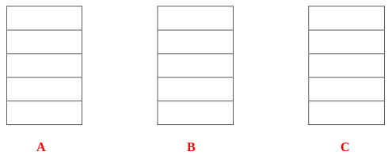
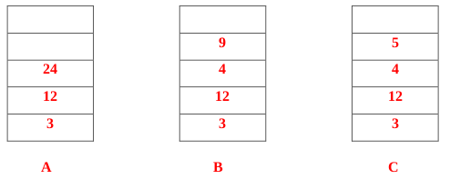
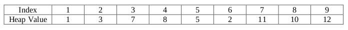
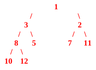
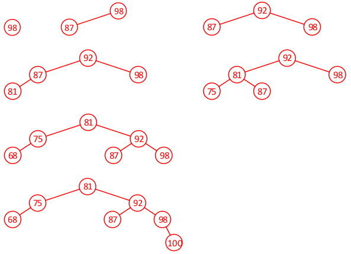
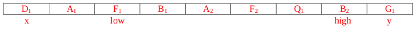
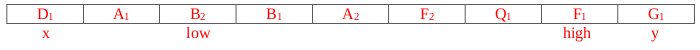

# Fall 2019

## Data Structures

### A 1: Dynamic Memory Management in C



#### 10 points

Consider a binary search tree where each node contains some key integer value and data in the form of a linked list of integers. The structures are shown below: the tree nodes and list nodes are dynamically allocated. We are going to eventually upgrade the structure, and when we do so, all of the dynamically allocated memory will be deleted \(including all of the linked lists\). Write a function called `deleteTreeList` that will take in the root of the tree, freeing all the memory space that the tree previously took up. Your function should take 1 parameter: a pointer to the root and it should return a null pointer representing the now empty tree.

```c
typedef struct listNode
{
  int value;
  struct listNode * next;
} listNode;

typedef struct treeNode
{
  struct treeNode * left;
  struct treeNode * right;
  int value;
  listNode * head;
} treeNode;

treeNode * deleteTreeList (treeNode * root)
{
  // your code
}
```



```c
treeNode * deleteTreeList (treeNode * root)
{
  // Checking the tree is empty 1 pt
  if (root == NULL)
    return NULL; // returning NULL 1 pt

  // Loop through (iterative or recursive) list at the node 1 pt
  while (root->head != NULL)
  {
    listNode * tmp = root->head; // Prevent use after free 1 pt
    root->head = root->head->next;
    free(tmp); // free 1 pt
  }

  // Freeing both children 1 pt each
  root->right = deleteTreeList(root->right);
  root->left = deleteTreeList(root->left);

  // Freeing the tree’s root 1 pt
  free(root); // If the root is free’d last 1 pt

  return NULL; // returning NULL at end 1 pt
}
```



### A 2: Linked Lists



#### 10 points

An alternate method of storing a string is to store each letter of the string in a single node of a linked list, with the first node of the list storing the first letter of the string. Using this method of storage, no null character is needed since the next field of the node storing the last letter of the string would simply be a null pointer. Write a function that takes in a pointer to a linked list storing a string and returns a pointer to a traditional C string storing the same contents. Make sure to dynamically allocate your string in the function and null terminate it before returning the pointer to the string. Assume that a function, length, exists already that you can call in your solution, that takes in a pointer to a node and returns the length of the list it points to. The prototype for this function is provided below after the struct definition.

```c
typedef struct node
{
  char letter;
  struct node* next;
} node;

int length(node* head);

char* toCString(node * head)
{
  // your code
}
```



```c
char* toCString(node * head)
{
  // Find length of the list.
  int len = length(head); // 1 pt

  // 2 pts – allocate space.
  char* res = malloc((len+1)*sizeof(char));
  int i=0; // 1 pt – init loop variable

  // Go through list – 4 pts, 1 pt per line.
  while (head != NULL)
  {
    res[i] = head->letter;
    head = head->next;
    i++;
  }
  // 1 pt – null terminate string.
  res[len] = '\0';

  // 1 pt – ret
  return res;
}
```

_**Note: other solutions are possible, map points accordingly.**_



### A 3: Stacks



#### 5 points

Evaluate the following postfix expression shown below, using the algorithm that utilizes an operand stack. Put the value of the expression in the slot provided and show the state of the operand stack \(in this case the stacks should just have numbers in them\) at each of the indicated points in the expression:

$$
3 \quad 4 \quad 2 \quad 1 \quad + \quad * \quad 24^A \quad 6 \quad / \quad 9^B \quad 4 \quad -^C \quad + \quad - \quad /
$$



Value of the Postfix Expression: **\_**





Value of the Postfix Expression: 1

_**Grading: 1 pt for each stack \(all or nothing\), 2 pts for the answer \(also all or nothing\)**_



### B 1: Binary Search Trees



#### 10 points

A modified BST node stores the sum of the data values in its sub-tree. **Complete** writing the insert function shown below _**recursively**_, so that it takes in a pointer to the root of a binary search tree, root, and an integer, value, inserts a node storing value in it into the tree and returns a pointer to the root of the resulting tree. Notice that this task is more difficult than a usual binary tree insert since the sum values in several nodes must be updated as well. The struct used to store a node is shown below.

```c
typedef struct bstNode 
{
  struct bstNode * left, * right;
  int data;
  int sum;
} bstNode;

bstNode* insert(bstNode * root, int value)
{
  if (root == NULL) 
  {
    bstNode* res = malloc(sizeof(bstNode));
    res->data = ________;
    res->sum = _________;
    res->left = ________;
    res->right = _______;
    return res;
  }
  if (value <= root->data)
    _________________________________________________ ;
  else
    _________________________________________________ ;

  _________________________________________________ ;

  return root;
}
```



```c
bstNode* insert(bstNode * root, int value)
{
  if (root == NULL) 
  {
    bstNode* res = malloc(sizeof(bstNode));
    res->data = value;  // 1 pt
    res->sum = value;   // 1 pt
    res->left = NULL;   // 1 pt
    res->right = NULL;  // 1 pt
    return res;
  }
  if (value <= root->data)
    root->left = insert(root->left, value);   // 2 pts
  else
    root->right = insert(root->right, value); // 2 pts

  root->sum += value;                         // 2 pts

  return root;
}
```



### B 2: Heaps



#### 5 points

The array below shows the storage of a **Min-Heap** in the _**middle**_ of an insert operation.

\(a\) \(1 pt\) What was the element that was in the process of being inserted?

\(b\) \(4 pts\) Draw a picture of the heap as a balanced binary tree after the completion of the insertion of the item.

Note that Index 0 is not shown, because the root of the Heap is at index 1.



Element in the process of being inserted: **\_**

Picture of the heap as a balanced binary tree _**after**_ insertion is complete:



Element in the process of being inserted: 2 _**\(Grading: 1 pt all or nothing\)**_



_**Grading: 1 pt for \(1,3,2\), 2 pts for \(8, 5, 7\), 1 pt for \(11, 10, 12\). If lots incorrect but heap property maintained, 2 pts total, If heap property isn't maintained 0 pts total**_



### B 3: AVL Trees



#### 10 points

\(a\) \(8 pts\) An AVL tree stores the grades of the class \(in between 1 and 100 inclusive\). Create an AVL tree by inserting the following values into an initially empty AVL Tree in the order given: 98, 87, 92, 81, 75, 68, and 100. Show the state of the tree _**after**_ each insertion and draw a box around each of these results.

\(b\) \(2 pts\) What is the fewest and most number of comparisons for looking for a valid grade that is _**not**_ within this tree?

Fewest number of comparisons = **\_\_**

Most number of comparisons = _**\_\_**_





_**Grading: 1 pt per correct tree. 1 pt if last tree is a valid AVL with all 7 elements**_

Fewest number of comparisons = 2 _**\(e.g. 76 compares against 81 and 75 only – 1 pt, all or nothing\)**_

Most number of comparisons = 4 _**\(e.g. 99 compares against 81, 92, 98, and 100– 1 pt, all or nothing\)**_



## Algorithms and Analysis Tools

### A 1: Algorithm Analysis



#### 10 points

Give the Big-O run-times for each of the following operations in terms of the variables given in the description. When a particular implementation is not explicitly stated, assume an efficient implementation is used. In order to earn full credit, you must provide a simplified, asymptotically tight bound. \(For example, if O\(n\) was the correct answer, O\(5n\) and O\(n 2 \) would not receive full credit, even though both are technically correct.\)

1. Merging a sorted array of size _**m**_ with a sorted array of size _**n**_ into one sorted array. 
2. Creating a heap out of _**n**_ unsorted integers.
3. **Worst case** run-time of running a Quick Sort on _**n**_ integers.
4. Inserting an element to the front of a linked list with _**n**_ elements.
5. Deleting _**m**_ items, one by one, from an **AVL** tree which originally contains _**n**_ items \(n ≥ _**m**_\)
6. A sequence of _**p**_ push operations onto a stack that originally had _**n**_ elements on it. \(Assume the stack has enough space to handle the sequence of push operations.\)
7. **Average case** run time of an insertion sort on _**n**_ unsorted integers.
8. Calculating $$a^b \bmod c$$, using fast modular exponentiation, assuming that each multiply and each mod operation take $$O(1)$$ time.
9. Pre-order traversal of a binary tree with height _**h**_ and _**n**_ nodes.
10. **Worst case** run-time for searching for an element in a binary search tree with _**n**_ nodes.



1. Merging a sorted array of size _**m**_ with a sorted array of size _**n**_ into one sorted array. $$O(m + n)$$
2. Creating a heap out of _**n**_ unsorted integers. $$O(n)$$
3. **Worst case** run-time of running a Quick Sort on _**n**_ integers. $$O(n^2)$$
4. Inserting an element to the front of a linked list with _**n**_ elements. $$O(1)$$
5. Deleting _**m**_ items, one by one, from an **AVL** tree which originally contains _**n**_ items \(n ≥ _**m**_\) $$O(m\log{n})$$
6. A sequence of _**p**_ push operations onto a stack that originally had _**n**_ elements on it. \(Assume the stack has enough space to handle the sequence of push operations.\) $$O(p)$$
7. **Average case** run time of an insertion sort on _**n**_ unsorted integers. $$O(n^2)$$
8. Calculating $$a^b \bmod c$$, using fast modular exponentiation, assuming that each multiply and each mod operation take $$O(1)$$ time. $$O(\log{b})$$
9. Pre-order traversal of a binary tree with height _**h**_ and _**n**_ nodes. $$O(n)$$
10. **Worst case** run-time for searching for an element in a binary search tree with _**n**_ nodes. $$O(n)$$



### A 2: Algorithm Analysis



#### 5 points

An algorithm to process input data about n cities takes O\(n!\) time. For n = 10, the algorithm runs in 10 milliseconds. How many _**seconds**_ should the algorithm take to run for an input size of n = 12? Put a box around your final answer.



Let the algorithm with input array size n have runtime $$(n) = cn!$$ , where c is some constant.

Using the given information, we have:

$$
T(10) = c(10!) = 10ms
\\
c = \cfrac{10ms}{10!}
$$

Now, solve for the desired information:

$$
T(12) = c(12!)
\\
\cfrac{10ms}{10!} × 12! = \cfrac{10ms}{10!} × 10! × 11 × 12 = 10ms × (132) = 1320ms = 1.32sec
$$

_**Grading: 2 pts solving for c, 2 pts for plugging 12 and canceling to get to 1320 ms, 1 pt to answer in seconds.**_



### A 3: Recurrence Relations



#### 10 points

Use the iteration technique to solve the following recurrence relation in terms of n:

$$
T(n) = 2T(n − 1) + 2^n , \text{for all integers n ≥ 1}
\\
T(0) = 1
$$

Please give an **exact closed-form answer in terms of n**, instead of a Big-Oh answer.



$$
T(n) = 2T(n − 1) + 2^n
\\
= 2(2T(n − 2) + 2^{n−1 }) + 2^n
\\
= 4T(n − 2) + 2^n + 2^n
\\
= 4T(n − 2) + 2(2^n )
\\
= 4(2T(n − 3) + 2^{n−2}) + 2(2^n )
\\
= 8T(n − 3) + 2^n + 2(2^n )
\\
= 8T(n − 3) + 3(2^n )
$$

After k steps, we have:

$$
= 2^k T(n − k) + k(2^n)
$$

Let k = n, then we have that:

$$
T(n) = 2^n T(n − n) + n(2^n )
\\
= 2^n T(0) + n(2^n )
\\
= 2^n + n(2^n )
\\
= (n + 1)(2^n )
$$

_**Grading: 2 pts for iteration with T\(n-2\), 2 pts for iteration with T\(n-3\), 2 pts for general guess after k steps. 1 pt for plugging in k = n \(or k = n-1\), 3 pts for simplifying that to the final answer.**_



### B 1: Recursive Coding



#### 10 points

The longest increasing subsequence problem is as follows: given a sequence of integers, find the largest subset of those integers such that within the sequence, those integers are in increasing order. For example, for the sequence **2**, 9, 4, **3**, 7, **5**, **6**, **8**, has some increasing subsequences of length 5 \(one of these is highlighted\) but none of length 6, so the length of the longest increasing subsequence of this sequence is 5.

In order to solve this problem recursively, we have to reformulate the problem a little bit. Namely, our input will be:

1. An array, _**values**_, storing the original sequence
2. An integer, _**k**_, representing that we want to only consider the values in the array upto index k, including it.
3. An integer, _**max**_, representing the maximum value allowed in the increasing sequence.

Our recursive function will return the length of the longest increasing subsequence of _**values**_\[0.._**k**_\] such that no value in the increasing subsequence exceeds max.

Complete the implementation of this _**recursive**_ function below:

```c
int lis(int* values, int k, int max)
{
  // your code
}
```



```c
int lis(int* values, int k, int max)
{
  if (k == 0) return values[0] <= max;

  int notake = lis(values, k-1, max);
  int take = 0;

  if (values[k] <= max)
    take = 1 + lis(values, k-1, values[k]-1);

  if (take > notake)
    return take;

  return notake;
}
```

#### Grading

* 3 pts base case \(there are other options here...we can use k = -1 for example, or nest a second if in

  the k == 0 one.

* 2 pts no take case - two points for this recursive call, don't take off if values is omitted...1 pt off

  per other two parameters

* 4 pts take case - 1 pt for checking if we can take the last value, 1 pt for the recursive call, 1 pt for a

  new max, 1 pt for adding 1

* 1 pt - return maximum of the two cases



### B 2: Sorting



#### 5 points

Quick Sort is not a stable sort. This means that if there are two elements in the input array, a\[i\] and a\[j\], are considered equal before the sort is executed with i &lt; j, the element originally stored in a\[j\] may appear _**before**_ the element originally stored in a\[i\], after the sort completes. Namely, the relative order of equivalent elements may not be maintained in the sort. \(For example, if we are sorting only by last name and in the original list “Doug Adams” appeared before “Sandy Adams”, then after the sort, it’s possible that “Sandy Adams” could appear before “Doug Adams”.\)

The reason this is the case is due to the partition function used in Quick Sort. Explain why the partition function doesn’t maintain the stability property mentioned above and provide a specific example where stability isn’t maintained. In your example, you can use letters with subscripts and sort the letters in alphabetical order.



In the partition function, there is both a low pointer and a high pointer for which the contents potentially get swapped. This means that without inspecting other items, an element in the lowest part of the array can be swapped into the highest part of the array, potentially skipping over an equivalent item.

Consider the partition of the following subarray, from index x to index y, inclusive, using index x as the partition element.



The typical in-place implementation of partition would move index low upto the letter F, moving past A, since F comes after D and would move index high down to B since B comes before D. After identifying these two items that are out of place \(F on the left side of the array and B on the right side of the array\), these items are swapped, so the new subarray looks like this:



as the partition concludes, no further changes are made to the array from indexes x to low, or from indexes high to y, as shown in the diagram above.

Notice that with this one swap, what has happened is that F 1 , which used to appear before F 2 in the array now appears after it. Similarly, B 2 , which used to appear after B 1 , got swapped into a position such that it now appears before B 1 .

_**Grading: 3 pts for a general explanation of how partition swaps elements far away, and 2 pts for the specific example. The example need not use letters and subscripts, but it must illustrate the idea clearly. Also, there are many different examples, even examples where the instability deals with the pivot element. Give full credit to all responses that have a trace through that includes instability.**_



### B 3: Backtracking



#### 10 points

Imagine a dating website that asks each user 20 yes/no questions and stores their answers in a single integer in between 0 and 2 20 -1, with the answer to the k th question stored in bit 2 k-1 , with the bit 0 representing the answer no and the bit 1 representing the answer yes for the corresponding question. \(So for example, if one person’s answers to questions 1, 3 and 4 were yes and the rest of the answers were no, the integer 1101 2 = 13 would be used to represent her 20 answers to the questions.\) Consider the problem of finding the “best match” for a client out of a list of prospective matches. We consider a match **A** for the client to be better than match B if she shares more answers on corresponding questions with **A** than **B**. Write a function that takes in an integer representing the client’s answers, an array of integers storing the answers of potential matches, and the length of that array, which returns the index into the array storing the best match for that client. If there are multiple best matches, you may return the index associated with any of them. A function has been given that you may call in your code, if you find it useful.

```c
int count(int mask);

int bestMatch(int client, int* matches, int length)
{
  // your code
}

int count(int mask)
{
  int res = 0, i;
  for (i=0; i<32; i++)
    if ((mask & (1<<i)) != 0)
      res++;
}
```



```c
int bestMatch(int client, int* matches, int length)
{
  int res = 0, best = -1, i;

  for (i=0; i<length; i++)
  {
    int tmp = 20 - count(client ^ matches[i]);

    if (tmp > best)
    {
      best = tmp;
      res = i;
    }
  }

  return res;
}
```

#### Grading:

* 1 pt for var declarations and initializations,
* 1 pt for for loop to length \(can start at 0 or 1 depending on initializations\),
* 3 pts for the appropriate XOR \(note that we don't have to do 20 -...we can simply choose to minimize the number of bits on in the xor\),
* 2 pts for the function call to count,
* 2 pts for the mechanism to select the appropriate index depending on the result of the function call,
* 1 pt for the return



## PDF Files







