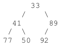
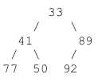
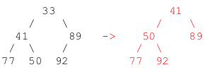
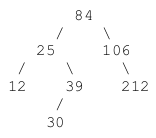
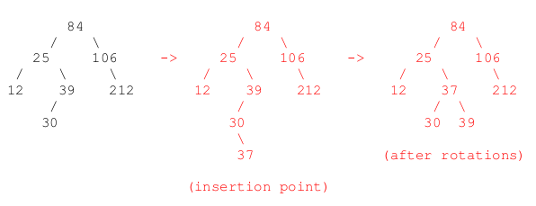

# Spring 2019

## Data Structures

### A 1: Dynamic Memory Management in C



#### 10 points

This problem relies on the following struct definition:

```c
typedef struct
{
  char *first;  // Employee's first name.
  char *last;   // Employee's last name.
  int ID;       // Employee ID.
} Employee;
Employee
```

Consider the following function, which takes three arrays – each of length _n_ – containing the first names, last names, and ID numbers of _n_ employees for some company. The function dynamically allocates an array of _n_ Employee structs, copies the information from the array arguments into the corresponding array of structs, and returns the dynamically allocated array.

```c
Employee *makeArray(char **firstNames, char **lastNames, int *IDs, int n)
{
  int i;
  Employee *array = malloc(__________________________);

  for (i = 0; i < n; i++)
  {
    array[i].first = malloc(__________________________);
    array[i].last = malloc(__________________________);

    strcpy(array[i].first, firstNames[i]);
    strcpy(array[i].last, lastNames[i]);
    array[i].ID = IDs[i];
  }
  return array;
}
```

1. Fill in the blanks above with the appropriate arguments for each `malloc()` statement.
2. Next, write a function that takes a pointer to the array created by the `makeArray()` function, along with the number of employee records in that array \(_n_\) and frees all the dynamically allocated memory associated with that array. The function signature is as follows:

```c
void freeEmployeeArray(Employee *array, int n)
{
  // your code
}
```



```c
Employee *makeArray(char **firstNames, char **lastNames, int *IDs, int n)
{
  int i;
  Employee *array = malloc(sizeof(Employee) * n);         // 1 pt

  for (i = 0; i < n; i++)
  {
    // The following blanks are worth 2 points EACH. Award 1 point each if close. Note that
    // (strlen(...) + 1) must be parenthesized in order to earn full credit.
    array[i].first = malloc(sizeof(char) * (strlen(firstNames[i]) + 1));
    array[i].last = malloc(sizeof(char) * (strlen(lastNames[i]) + 1));

    strcpy(array[i].first, firstNames[i]);
    strcpy(array[i].last, lastNames[i]);
    array[i].ID = IDs[i];
  }
  return array;
}

void freeEmployeeArray(Employee *array, int n)
{
  int i;  // 1 point for declaring i and having no syntax errors below

  for (i = 0; i < n; i++)   // 1 point for looping correctly
  {
    free(array[i].first);   // 1 point for this free() statement
    free(array[i].last);    // 1 point for this free() statement
  }

  free(array);              // 1 point for this free() statement
}
```



### A 2: Linked Lists



#### 10 points

Consider the following code:

```c
void doTheThing(node *head, node *current)
{
  if (current == NULL)
    return;
  else if (current == head->next)
  {
    if (current->data == head->next->next->data)
      doTheThing(head, head->next->next->next);
    else if (current->data == head->next->next->data + 1)
      doTheThing(head, head->next->next->next->next);
    else if (current->data == head->next->next->data + 5)
      doTheThing(head, current->next->next->next);
    else if (current->data == head->next->next->data + 10)
      doTheThing(head, head->next);
    else
      doTheThing(head, current->next);
  }
  else
    doTheThing(head, current->next);
}
```

Draw a linked list that simultaneously satisfies both of the following properties:

1. The linked list has **exactly four nodes**. Be sure to indicate the integer value contained in each node.
2. If the linked list were passed to the function above, the program would either crash with a segmentation fault, get stuck in an infinite loop, or crash as a result of a stack overflow \(infinite recursion\).

**Note**: When this function is first called, the head of your linked list will be passed as both arguments to the function, like so:

```c
doTheThing(head, head);
```

**Hint**: Notice that all the recursive calls always pass head as the first parameter. So, within this function, head will always refer to the actual head of the linked list. The second parameter is the only one that ever changes.



The only way to get wrecked with this code is to trigger the `doTheThing(head, head->next)` call. Since we only trigger that call when `current == head->next` , then making that recursive call results in infinite recursion.

That specific recursive call is only executed when `current == head->next` \(i.e., when current is the second node in the linked list\) and when that second node has a value that is 10 greater than the value in the third node. For example:

```text
[1]->[18]->[8]->[3]->

* The first and last values can be anything, but the second value needs to be exactly 10 greater than the third value.
```

Note that none of the excessive `->next->next->next` accesses would ever cause segfaults here, since we always have four nodes in the linked list, and we never get to those accesses unless _current_ is the second node in the linked list. Even the `head->next->next->next->next` access wouldn’t cause a segfault; it would just pass NULL to the function recursively, which would hit a base case and return gracefully.

_**Grading:**_

* **10 points** for a correct answer. Note: If the 2 nd node has a value 10 less than the 3 rd node, still award 10/10.
* **5 points** if the 2 nd node has a value 1 greater than the 3 rd node, thereby triggering the `head->next- >next->next->next` access. That doesn’t cause a segfault, but it’s an understandable mistake and is the next best thing. Note: If the 2 nd node has a value 1 less than the 3 rd node, still award 5/10.
* **2 points** otherwise, as long as they draw a linked list with exactly four nodes, and each node contains an integer. \(Also, any circular list with 4 nodes gets 2 points maximum.\)
* **0 points** otherwise.

_**FURTHER GRADING NOTES: A circular list should get at most 2 points. It's clear from the question that the intent is for the list not to be circular but a regular linked list. The reason this is clear is that the way the code is written, we look for the base case with a NULL pointer, but a circular linked list doesn't have one of those. So, ANY circular linked list of size 4 will cause an infinite loop, so one can put any four values down and the second item would be satisfied, which means the second item would be irrelevant. This should help a student realize that the intent was for the answer to be a regular linked list that isn't circular and what's being graded are the specific values they pick for the four nodes. When people refer to a regular linked list, they just say "linked list", they don't say "a linked list that isn't circular and doesn't have links." Instead, the assumption is that unless specified otherwise, a linked list has a head and a single pointer to the next node.**_



### A 3: Stacks and Queues



#### 5 points

Consider the following function:

```c
void doTheThing(void)
{
  int i, n = 9; // Note: There are 9 elements in the following array.
  int array[] = {3, 18, 58, 23, 12, 31, 19, 26, 3};

  Stack *s1 = createStack();
  Stack *s2 = createStack();
  Queue *q = createQueue();

  for (i = 0; i < n; i++)
    push(s1, array[i]);

  while (!isEmptyStack(s1))
  {
    while (!isEmptyStack(s1))
      enqueue(q, pop(s1));  // pop element from s1 and enqueue it in q
    while (!isEmptyQueue(q))
      push(s2, dequeue(q)); // dequeue from q and push onto s2

    printf("%d ", pop(s2)); // pop from s2 and print element

    while (!isEmptyStack(s2))
      push(s1, pop(s2));    // pop from s2 and push onto s1
  }

  printf("Tada!\n");

  freeStack(s1);
  freeStack(s2);
  freeQueue(q);
}
```

What will be the exact output of the function above? \(You may assume the existence of all functions written in the code, such as createStack\(\), createQueue\(\), push\(\), pop\(\), and so on.\)



_**Solution:**_ 3 18 58 23 12 31 19 26 3 Tada! \(This function just ends up printing the contents of the array in order.\)

_**Grading:**_

* **5 points** for the correct output
* **4 points** if their output was simply missing the “Tada!” or if their output was off by one value
* **2 points** if they printed the array in reverse order.
* **0 points** otherwise.

Feel free to award partial credit if you encounter something else that seems reasonable.



### B 1: Binary Trees



#### 5 points

Write a **recursive** function to print a postorder traversal of all the integers in a binary tree. The node struct and function signature are as follows:

```c
typedef struct node
{
  struct node *left;
  struct node *right;
  int data;
} node;

void print_postorder(node *root)
{
  if (root == NULL)
    return;

  postorder(root->left);
  postorder(root->right);
  printf("%d ", root->data);
}
```

**Grading**

* **+1 point** for correct base case
* **+1 point** for making both recursive calls \(regardless of order\)
* **+1 point** for printing root-&gt;data \(regardless of order\)
* **+1 point** for having both recursive calls, printing root-&gt;data, and doing all those things in the correct order.
* **+1 point** for getting all the syntax correct. \(So, for example, if they called postorder\(root left\) and postorder\(root.right\), they can get the 1 point for making both recursive calls, but they lose this 1 point for using the dot instead of the arrow.\)



```c
typedef struct node
{
  struct node *left;
  struct node *right;
  int data;
} node;

void print_postorder(node *root)
{
  // your code
}
```



### B 2: Heaps



#### 10 points

**\(a\)** Show the result of inserting the value 24 into the following minheap.



**\(b\)** Show the result of deleting the root of the following minheap.



**\(c\)** Using big-oh notation, what is the **worst-case** runtime for deleting the minimum element from a minheap that has _n_ nodes?



**\(a\)**


**Grading \(4 pts for part a\):**

* 4/4 if correct
* 2/4 if not correct, but they satisfy at least one of the following: \(1\) 24 ends up at the root, \(2\) the structure of the tree is the same as above \(despite where the values ended up\).
* 0/4 otherwise

**\(b\)**



**Grading \(4 pts for part b\):**

* 4/4 if correct
* 2/4 if not correct, but they satisfy at least one of the following: \(1\) 41 ends up at the root, \(2\) the structure of the tree is the same as above \(despite where the values ended up\).
* 0/4 otherwise

**\(c\)**

Solution: O\(log n\)

**Grading: 2 pts, all or nothing.**



### B 3: AVL Trees



#### 10 points

**\(a\)** Show the result of inserting 37 into the following AVL tree:



**\(b\)** Using big-oh notation, give the **best-case** runtime for inserting a new element into an AVL tree with _n_ nodes:

**\(c\)** Using big-oh notation, give the **worst-case** runtime for inserting a new element into an AVL tree with _n_ nodes:

**\(d\)** Using big-oh notation, give the **best-case** runtime for inserting a new element into a binary search tree with _n_ nodes:

**\(e\)** Using big-oh notation, give the **worst-case** runtime for inserting a new element into a binary search tree with _n_ nodes:



**\(a\)**



**Grading \(6 points for part a\):**

* 6/6 for correct answer.
* 3/6 for something reasonably close. \(Use your judgment. However, 84 must be the root in order for them to earn these points.\)
* 0/6 otherwise.

**\(b\)**

Solution: O\(log n\)

**Grading: 1 point if correct, 0 otherwise**

**\(c\)**

Solution: O\(log n\)

**Grading: 1 point if correct, 0 otherwise**

**\(d\)**

Solution: O\(1\)

**Grading: 1 point if correct, 0 otherwise**

**\(e\)**

Solution: O\(n\)

**Grading: 1 point if correct, 0 otherwise**



## Algorithms and Analysis Tools

### A 1: Algorithm Analysis



#### 10 points







### A 2: Algorithm Analysis



#### 5 points







### A 3: Summations and Recurrence Relations



#### 10 points







### B 1: Recursive Coding



#### 5 points







### B 2: Sorting



#### 10 points







### B 3: Bitwise Operators



#### 10 points







## PDF Files







