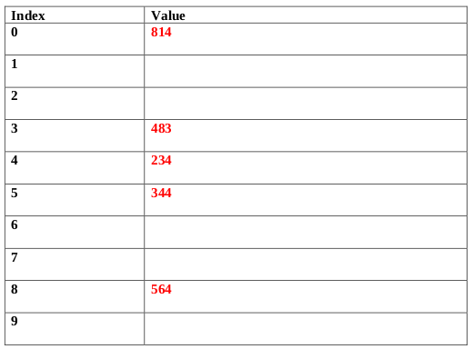

# Summer 2019

## Data Structures

### A 1: Dynamic Memory Management in C




#### 10 points

Suppose we have an array of structures containing information about Cartesian points. The struct shown below contains two integers, one for the x coordinate and one for the y coordinate. For this problem, write a function, createPoints, to create some random Cartesian points with each coordinate set to a random integer in between 0 and 10, inclusive.

`createPoints` takes in the number of points to be created, _numPoints_. Your function should dynamically allocate an array of _numPoints_ CartPoints structs and set each of their x and y coordinates with pseudorandom integer values in between 0 to 10, inclusive. You may assume that the random number generator has been seeded already. Your function should return a pointer to the array that was created and initialized.

```c
typedef struct CartPoint
{
  int x;
  int y;
} CartPoint;

CartPoint* createPoints(int numPoints)
{
  int i;

  // your code
}
```





```c
typedef struct CartPoint
{
  int x;
  int y;
} CartPoint;

CartPoint* createPoints(int numPoints)
{
  int i;

  // LHS = 1 pt, 3 pts RHS
  CartPoint *somePoints = malloc(sizeof(struct CartPoint) * numPoints);

  for(i=0; i<numPoints; i++)        // 1 pt
  {
    somePoints[i].x = rand() % 11;  // 2 pts
    somePoints[i].y = rand() % 11;  // 2 pts
  }

  return somePoints;                // 1 pt
}
```




### A 2: Linked Lists




#### 10 points

Suppose we have a queue implemented as a doubly linked list using the structures shown below with head pointing to node at the front of the queue and tail pointing to the node at the end of the queue.

```c
typedef struct node
{
  int data;
  struct node *next, *prev;
} node;

typedef struct queue
{
  int size;
  node *head, *tail;
} queue;
```

Write an enqueue function for this queue. If the queue is already full, return 0 and take no other action. If the queue has not been created yet, return 0 and take no other action. If the queue isn't full, enqueue the integer item into the queue, make the necessary adjustments, and return 1. Since there is no fixed size, the queue will be considered full if a new node can't be allocated.

```c
int enqueue(queue *thisQ, int item)
{
  struct node *newNode = ____________________________________ ;

  if(thisQ == NULL) return 0;
  if(newNode == NULL) return 0;

  newNode->data = _________;
  newNode->next = _________;
  thisQ->size = _______________________;

  if(thisQ->head == NULL)
  {
    newNode->prev = ____________;
    thisQ->head = ______________;
    thisQ->tail = ______________;
    return 1;
  }

  _____________________________________________;
  _____________________________________________;
  _____________________________________________;

  return 1;
}
```





```c
int enqueue(queue *thisQ, int item)
{
  struct node *newNode = malloc(sizeof(struct node)); // 1 pt

  if(thisQ == NULL) return 0;
  if(newNode == NULL) return 0;

  newNode->data = item;                               // 0.5 pt
  newNode->next = NULL;                               // 0.5 pt
  thisQ->size = thisQ->size + 1;                      // 0.5 pt

  if(thisQ->head == NULL)
  {
    newNode->prev = NULL;                             // 0.5 pt
    thisQ->head = newNode;                            // 0.5 pt
    thisQ->tail = newNode;                            // 0.5 pt
    return 1;
  }

  newNode->prev = thisQ->tail;                        // 2 pts
  thisQ->tail->next = newNode;                        // 2 pts
  thisQ->tail = newNode;                              // 2 pts

  return 1;
}
```

**_Grading Note: Please count total points and round down to record an integer, so 8.5 gets recorded as 8, and 8.0 also gets recorded as 8._**




### A 3: Stacks




#### 5 points

Convert the following infix expression to postfix using a stack. Show the contents of the stack at the indicated points (1, 2, and 3) in the infix expression.







**_Grading: 1 point for each stack, 2 points for the whole expression (partial credit allowed.)_**




### B 1: Binary Trees




#### 10 points

What does the function call `solve(root)` print out if root is pointing to the node storing 50 in the tree shown below? The necessary struct and function are provided below as well. Please fill in the blanks shown below. (Note: the left pointer of the node storing 50 points to the node storing 5, and all of the pointers shown correspond to the direction they are drawn in the picture below.)


```c
typedef struct bstNode
{
  int data;
  struct bstNode *left;
  struct bstNode *right;
} bstNode;

int solve(bstNode* root)
{
  if (root == NULL) return 0;

  int res = root->data;
  int left = solve(root->left);
  int right = solve(root->right);

  if (left+right > res)
    res = left+right;

  printf("%d, ", res);
  return res;
}
```

**\_** , **\_** , **\_** , **\_** , **\_** , **\_** , **\_** , **\_** , **\_** , **\_**





18, 7, 7, 11, 18, 36, 3, 8, 13, 50

_**Grading: 1 pt per correct number in the correct slot.**_




### B 2: Hash Tables




#### 5 points

Insert the following numbers (in the order that they are shown from left to right) into a hash table with an array of size 10, using the hash function, $H(x) = x\mod{10}$.

234, 344, 483, 564, 814

Show the result of the insertions, assuming any hash collisions are resolved through **quadratic probing.**








**_Grading: Give 1 pt for each value listed in the correct spot. If more than one value is in a single spot, give 0 pts for all values in that particular slot automatically._**




### B 3: Tries




#### 10 points

In many word games, the player is given some tiles with letters and must form a word with those tiles. Given a trie that stores a dictionary of valid words and a frequency array storing information of the tiles a player has, determine the number of unique words she can form with those tiles. Complete the function shown below to solve the given problem. Note: the entry in freq[i] represents the number of tiles with the letter 'a' + i. **(Hint: recursing down the trie is exactly like placing a tile down, which means updating the freq array. When you have finished "trying a tile" you have to put it back into your pool, which means editing the freq array again.)**

```c
typedef struct TrieNode
{
  struct TrieNode *children[26];
  int flag; // 1 if the string is in the trie, 0 otherwise
} TrieNode;

int countWords(TrieNode* root, int freq[])
{
  int res = ______________________ ;

  int i;
  for (i=0; i<26; i++)
  {
    if ( ___________________ || __________________________ )
    continue;

    __________________________________________ ;

    res += ______________________________________________ ;

    __________________________________________ ;
  }

  return res;
}
```





```c
typedef struct TrieNode
{
  struct TrieNode *children[26];
  int flag; // 1 if the string is in the trie, 0 otherwise
} TrieNode;

int countWords(TrieNode* root, int freq[])
{
  int res = root->flag;                               // 1 pt

  int i;
  for (i=0; i<26; i++)
  {
    if (freq[i] == 0 || root->children[i] == NULL)    // 4 pts
    continue;

    freq[i]--;                                        // 1 pt

    res += countWords(root->children[i], freq);       // 3 pts

    freq[i]++;                                        // 1 pt
  }

  return res;
}
```




## Algorithms and Analysis Tools

### A 1: Algorithm Analysis




#### 10 points

Consider storing a table with indexes 0 to N-1, where $N = k^2$ , for some positive integer k, that starts with all entries equal to 0 and allows two types of operations: (1) adding some value to a particular index, and (2) querying the sum of all the values in the table from index 0 through index _m_, for any positive integer m < N. One way to implement a "table" to handle these two operations is to store two separate arrays, _groups_, of size k and _freq_, of size N. _freq stores_ the current value of each index in the table. For the array _groups_, index i (0 ≤ i < k) stores the sum of the values in _freq_ from index iN to index (i+1)N-1. (For example, if N = 25, then _groups[2]_ stores the sum of the values of freq, from _freq[10]_ through _freq[14]_, inclusive.

Determine, **_with proof_**, the run-time of implementing operation (1) on this table using this storage mechanism and determine, **_with proof_**, the run-time of implementing operation (2) on this table using this storage mechanism. (For example, if N = 100 and we had a query with _m_ = 67, to get our answer we would add _groups[0]_, _groups[1]_, _groups[2]_, _groups[3]_, _groups[4]_, _groups[5]_, _freq[60]_, _freq[61]_, _freq[62]_, _freq[63]_, _freq[64]_, _freq[65]_, _freq[66]_ and _freq[67]_. Notice that since the ranges 0-9, 10-19, 20-29, 30-39, 40-49, and 50-59 are fully covered in our query, we could just use the groups array for each of those sums. We only had to access the freq array for the individual elements in the 60s.)

Your answers should be Big-Oh answers in terms of N as defined above.





To add a value to a particular index in the table, we must do one update in each of our two arrays. For example, to add x to table index i, we would do these two updates:

freq[i] += x;
groups[i/k] += x;

Namely, we are redundantly storing our information in two places, so both places must be updated. This runs in O(1) time since each update is a simple statement/command.

A query has a different analysis since we are looking for the sum of items in the table from index 0 through some given index m, where m can range from 0 all the way to N-1. The key observation though is that we will never look at all items in freq for any query. If our query is to a "large value" of m, by adding multiple values in groups, we can do our work more quickly, adding k values at a time. In the worst case, we will add at most k values from the groups array. Notice that since the groups array entries represent table sums of k elements, when we have to add items from the freq array, we will never add more than k of them, since if we were to have added k of them, we could have just added one more value from the groups array. Thus, we do a maximum of k accesses to the groups array and a maximum of k-1 accesses to the freq array, for a total of $O(k)$ time. Since the question asks to respond in terms of N, note that $k = √N$, so the run time of a query operation is $O(√N)$

**_Grading: 1 pt for update answer, 3 pts for proof, 2 pts for query answer, 4 pts for proof. Latter proof should explain why no more than k accesses of the freq array are necessary to handle any query. Give partial for proofs as you see fit. There is no need for descriptions to be as long or detailed as the solution given above._**




### A 2: Algorithm Analysis




#### 5 points

An algorithm to process a query on an array of size n takes $O(√n)$ time. For $n = 10^6$ , the algorithm runs in 125 milliseconds. How many **_seconds_** should the algorithm take to run for an input size of $n = 64,000,000$?





Let the algorithm with input array size n have runtime $(n) = c√n$ , where c is some constant.

Using the given information, we have:

$$
T(10 6 ) = c \sqrt{10^6} = 125ms
\\
c(1000) = 125ms
\\
c = .125ms = \frac{1}{8}ms
$$

Now, solve for the desired information:

$$
T(64 × 10^6) = c \sqrt{64 × 10^6}
\\
= \frac{1ms}{8} × \sqrt{64} × \sqrt{10^6}
\\
= \frac{8 × 1000ms}{8} = 1000ms = 1second
$$

**_Grading: 2 pts solving for c, 2 pts for plugging 64,000,000 and canceling to get to 1000 ms, 1 pt to answer 1 second as the question requests._**




### A 3: Recurrence Relations




#### 10 points

Recall that $\sum_{i = 0}^{n - 1} = 2^i = 2^n - 1$

Use the iteration technique to find a Big-Oh bound for the recurrence relation below. Note: you may find 2 i the following mathematical results helpful: $2^{\log_3 n} = n^{\log_3 2}$, and $\sum_{i = 0}^\infin (\frac{2}{3})^i = 3$ . You may use these without proof in your work below.

$$
T(n) = 2T (\frac{n}{3}) + O(n) \text{, for n > 1}
\\
T(1) = O(1)
$$





$$
T(n) = 2T (\frac{n}{3}) + cn
\\
T(n) = 2(2T (\frac{n}{9}) + c (\frac{n}{3})) + cn
\\
T(n) = 4T (\frac{n}{9}) + c((\frac{2n}{3}) + n)
\\
T(n) = 4(2T (\frac{n}{27}) + c (\frac{n}{9})) + c((\frac{2n}{3}) + n)
\\
T(n) = 8T (\frac{n}{27}) + c((\frac{4n}{9}) + (\frac{2n}{3}) + n)
$$

Now that we've done three iterations, we can guess the form of the recurrence after k iterations:

$$
T(n) = 2^kT(\frac{n}{3^k}) + cn(\sum_{i = 0}^{k - 1} (\frac{2}{3})^i)
$$

We want to plug in a value of k to this formula such that $\frac{n}{3^k} = 1$, which occurs when $n = 3^k$. By definition of log, we have that $k = \log_3 n$. We will bound the summation by taking it to infinity instead of k-1:

$$
T(n) = 2^{\log_3 n}T(1) + cn(\sum_{i = 0}^{\infin} (\frac{2}{3})^i)
$$

Now, we can use both given hints to arrive at:

$$
T(n) ≤ n^{\log_3 2} + 3cn = O(n)
$$

Note that $log_3 3 = 1$, so if follows that $log_3 2 < 1$. Thus, the dominant term is $3cn$, which is $O(n)$.

**_Grading: Part A - 1 pt for restating original recurrence, 1 pt for getting to second iteration, 2 pts for getting to third iteration, 2 pts for the correct guess of the general form after k iterations, 1 pt for getting the appropriate value of k to plug in, 2 pts to properly simplify both terms, 1 pt to decide which of the two terms is dominant and give the final answer._**




### B 1: Recursive Coding




#### 10 points

Consider writing a recursive method that counts the number of paths from a starting (x, y) location on the Cartesian plane to an ending (x, y) location. Let the starting location be _(sx, sy)_ and the ending location be _(ex, ey)_, where all four coordinates are integers with _sx ≤ ex_ and _sy ≤ ey_, and for each step on a valid path, either 1 must get added to the current x coordinate or 1 must get added to the current y coordinate. In addition, some given locations are disallowed as intermediate locations on the path. **Complete the function shown below** to solve this task. The input to the function takes in sx, sy, ex, ey and a two dimensional integer array named _allowed_, such that _allowed[x][y]_ is set to 1 if a path is _allowed_ to go on coordinate (x, y) or set to 0 otherwise. It is guaranteed that _(sx, sy)_ and _(ex, ey)_ are coordinates which are both inbounds and an inbounds function is provided for you. It's not guaranteed that both _(sx, sy)_ and _(ex, ey)_ are valid locations to be on. In this case, the answer is 0.

```c
#define N 10
int inbounds(int x, int y);

int numpaths(int sx, int sy, int ex, int ey, int allowed[][N])
{
  if (!allowed[sx][sy]) return ___;
  if (sx > ex || sy > ey) return ___;
  if (sx == ex && sy == ey) return ___;

  int res = ___ ;

  if ( _______________________ )
    res += numpaths(____, ____, ____, ____, __________);

  if ( _______________________ )
    res += numpaths(____, ____, ____, ____, __________);

  return res;
}

int inbounds(int x, int y)
{
  return x >= 0 && x < N && y >= 0 && y < N;
}
```





```c
#define N 10
int inbounds(int x, int y);

int numpaths(int sx, int sy, int ex, int ey, int allowed[][N])
{
  if (!allowed[sx][sy]) return 0;                               \\ 1 pt
  if (sx > ex || sy > ey) return 0;                             \\ 1 pt
  if (sx == ex && sy == ey) return 1;                           \\ 1 pt

  int res = 0;                                                  \\ 1 pt

  if (inbounds(sx+1, sy))                                       \\ 1 pt
    res += numpaths(sx+1, sy, ex, ey, allowed);                 \\ 2 pts

  if (inbounds(sx, sy+1))                                       \\ 1 pt
    res += numpaths(sx, sy+1, ex, ey, allowed);                 \\ 2 pts

  return res;
}

int inbounds(int x, int y)
{
  return x >= 0 && x < N && y >= 0 && y < N;
}
```

**_Grading Note: To earn 1 pt slots, answers must be perfect. On the two pt lines, award 2 pts if all 5 slots are correct, award 1 pt if at least 2 slots are correct, the order of the if statements doesn't matter but the inbounds check must correspond to the recursive call in its if statement._**




### B 2: Sorting




#### 5 points

In both Merge Sort and Quick Sort, in class we are taught to break down the sorting problem recursively such that the base case is a subarray of size 1 (or 0). It turns out that for both, on average, the implementation is _faster_ if we have a base case with a subarray of size in between 20 and 50 and use a $O(n^2)$ sort (typically insertion sort) to sort the base case subarray. Even though insertion sort is $O(n^2)$, why does this modification to the algorithm result in a speed up for both Merge Sort and Quick Sort?





There is a great deal of overhead with recursive calls. Namely, when a new function call is executed, memory is allocated for that function on the call stack and parameters are passed (actual values copied into formal parameter slots), then the function can start running. A vast majority of the total # of recursive calls in the call branches of either of these functions occurs for small arrays. For an array of size 32, at least 31 recursive calls get made. While for large arrays an insertion sort is slower than Merge or Quick sort, for small arrays, the insertion sort if faster because of the overhead of all of these recursive calls. Also, insertion sort only does quick local array accesses so though it does more steps, they are generally faster steps. Thus, if we make our base case larger, what we are doing is substituting something that is slower (a Merge Sort or Quick Sort of 30 or so values) with something that is faster (an Insertion Sort of 30 or so values). Naturally, if we have a set of steps in an algorithm and substitute some of those steps with faster ones, our new algorithm is faster. The key is to set this base case right near that tipping point of the optimal difference between the two sorts for small values.

**_Grading: There are quite a few ways to explain this that are valid. The crux of it is that for small arrays, the overhead of the recursion slows the algorithm down so much, it's slower than a simple sort that does more steps but does them without extra function calls and has quick array accesses. Making these substitutions speeds up the overall algorithm since we are substituting something slower for something faster. Give credit based on how complete and convincing the argument given is. Read several responses before calibrating the grading scale._**




### B 3: Backtracking




#### 10 points

Consider an arbitrary permutation of the integers 0, 1, 2, ..., n-1. We define the "jumps" in a permutation array _perm_ to be the set of values of the form _perm[i] - perm[i-1]_, with _1 ≤ i ≤ n-1_. For this problem you will write a backtracking solution count the number of permutations that can be created given a limited set of jumps. The function will take in arrays _perm_, representing the current permutation array, _used_, storing which items were used in the current permutation, k, the number of fixed items in the current permutation, _jumps_, an array storing the valid jumps allowed, and _len_, representing the length of the jumps array. The length of the _perm_ and _used_ arrays will be the constant N. Note that the _jumps_ array contains both positive and negative values. For example, the permutation 3, 0, 2, 1 has the following jumps: -3, 2 and -1. **Complete the framework that has been given below to solve the problem.**

```c
#include <stdio.h>
#define N 10

int numperms(int perm[], int used[], int k, int* jumps, int len)
{
  int i, j, res = 0;

  if (k == N) return ___;

  for (i=0; i<N; i++)
  {
    if (used[i]) _____________;

    int flag = 0;

    if (k == 0)
      flag = ___;
    else
      for (j=0; j < ____; j++)
        if ( ____________ == jumps[j])
          flag = ___;

    if (flag)
    {
      used[i] = ___;
      perm[k] = ___;
      res += numperms(perm, used, _____, jumps, len);
      used[i] = ___;
    }
  }

  return res;
}
```





```c
#include <stdio.h>
#define N 10

int numperms(int perm[], int used[], int k, int* jumps, int len)
{
  int i, j, res = 0;

  if (k == N) return 1;                                   // 1 pt

  for (i=0; i<N; i++)
  {
    if (used[i]) continue;                                // 1 pt

    int flag = 0;

    if (k == 0)
      flag = 1;                                           // 1 pt
    else
      for (j=0; j < len; j++)                             // 1 pt
        if ( i-perm[k-1] == jumps[j])                     // 1 pt
          flag = 1;                                       // 1 pt

    if (flag)
    {
      used[i] = 1;                                        // 1 pt
      perm[k] = 1;                                        // 1 pt
      res += numperms(perm, used, k + 1, jumps, len);     // 1 pt
      used[i] = 0;                                        // 1 pt
    }
  }

  return res;
}
```

**_Grading 1 pt per slot, must be correct to earn point._**




## PDF Files




