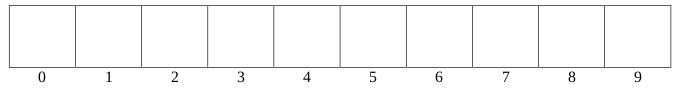
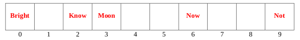

# Spring 2020

## Data Structures

### A 1: Dynamic Memory Management in C



#### 10 points

Suppose we have an array to store the TV shows we wanted to watch over break. Now that the break is over, we have watched all the shows and we need to delete our list. Our array is an array of structures that contains the name of each show and the number of seasons to watch for that show. The name of the show is a dynamically allocated string to support the different lengths of show names. Write a function called delete\_show\_list that will take in the show array as well as the length of that array, and free all the memory space that the array previously took up. Your function should take in 2 parameters: the array called show\_list and the length of that array, length. It should free all the dynamically allocated memory associated with the list and return NULL, to indicate that the list has been deleted.

```c
struct tv_show
{
    char *show_name;
    int number_of_seasons;
};

struct tv_show * delete_show_list (struct tv_show *show_list, int length)
{
    // your code
};
```



```c
struct tv_show
{
    char *show_name;
    int number_of_seasons;
};

struct tv_show * delete_show_list (struct tv_show *show_list, int length)
{
    int i;
    
    for(i = 0; i < length; i++)        // 2 pts
        free(show_list[i].show_name);  // 3 pts

    free(show_list);                   // 3 pts
    
    return NULL;                       // 2 pts
};
```



### A 2: Linked Lists



#### 5 points

Suppose we have a linked list implemented with the structure below. We also have a function that takes in the head of the list and the current number of nodes in the list.

```c
typedef struct node 
{
    int num;
    struct node* next;
} node;

int whatDoesItDo (node * head, int size) 
{
    node * current = head;
    node * other;
    
    if (size < 2)
        return size;
        
    other = head->next;
    
    while (current != NULL) 
    {
        current->next = other->next;
        free(other);
        current = current->next;
        size--;
        if(current != NULL && current->next !=NULL) 
        {
            current = current->next;
            other = current->next;
        }
    }
    
    return size;
}
```

If we call `whatDoesItDo(head, 8)` on the following list, show the list after the function has finished and state the return value.

head -&gt; 3 -&gt; 8 -&gt; 12 -&gt; 5 -&gt; 1 -&gt; 7 -&gt; 19 -&gt; 2



Picture of List Pointed to by head After Function Call: Head -&gt; 3 -&gt; 12 -&gt; 5 -&gt; 7 -&gt; 19

Function Return Value: 5

_**Grading: 2 pts for return value \(all or nothing\), 3 pts for list, give 3 pts if correct, give 2 pts if off by 1 item, 1 pt if off by 2 items, 0 otherwise.**_



### A 3: Stacks



#### 10 points

Suppose we have implemented a stack using a linked list. The structure of each node of the linked list is shown below. The stack structure contains a pointer to the head of a linked list and an integer, size, to indicate how many items are on the stack.

```c
typedef struct node 
{
    int num;
    struct node* next;
} node;

typedef struct Stack 
{
    struct node *top;
    int size;
} stack;
```

Write a function that will pop off the contents of the input stack and push them onto a newly created stack, returning a pointer to the newly created stack. In effect, your function should reverse the order of the items in the original stack, placing them in a new stack. Assume you have access to all of the usual stack functions. Assume that when you push an item onto the stack, its size automatically gets updated by the push function. Similarly for pop, size gets updated appropriately when you pop an item from a stack. Do NOT call pop or peek on an empty stack.

```c
void push(stack *s, int number); // Pushes number onto stack.
int pop(stack *s); // Pops value at top of stack, and returns it.
int peek(stack *s); // Returns value at top of stack.
int isEmpty(stack *s); // Returns 1 iff the stack is empty.

stack* reverseStack(stack* s) 
{
    stack *newS = malloc(sizeof(stack));
    
    // your code
    
    return newS;
}
```



```c
stack* reverseStack(stack* s) 
{
    stack *newS = malloc(sizeof(stack));
    
    news->size = 0;           // 2 pts
    newS->top = NULL;         // 2 pts
    
    while(!isEmpty(s))        // 3 pts
        push(newS, pop(s));   // 3 pts
    
    return newS;
}
```



### B 1: Binary Trees



#### 10 points

Write a function named `fsl()` \(which stands for “find smallest leaf”\) that takes a pointer to the root of a binary tree as its only argument and returns the value of the smallest **leaf** node in the tree. Note that the tree passed to your function will **not** necessarily be a binary **search** tree. If the pointer root is NULL, fsl should return INT\_MAX, which is defined below. 

You **cannot** write any helper functions for this problem. You must complete all of your work in a single function. The function signature and node struct are given below.

```c
#define INT_MAX 2147483647

typedef struct node 
{
    int data;
    struct node *left;
    struct node *right;
} node;

int fsl(node *root) 
{
    // your code
}
```



```c
int fsl(node *root) 
{
    int l_min;
    int r_min;
    
    if (root == NULL)      // 2 pts: checking for NULL as base case
        return INT_MAX;    // 1 pt
    
    if (root->left == NULL && root->right == NULL)    // 2 pts: identify leaf
        return root->data;                            // 1 pt: correct return value
                                                      // when leaf is encountered
        
    l_min = fsl(root->left);    // 2 pts: correct recursive calls (give only 1 pt
    r_min = fsl(root->right);   // here if only one recursive call)

    return (l_min < r_min) ? l_min : r_min); // 2 pts: returning min of these two
                                             // values        
}
```



### B 2: Hash Tables



#### 5 points

Consider the following hash function, and then answer the questions that follow:

```c
// This function assumes str is non-NULL and non-empty.
int hash(char *str) 
{
    int index = strlen(str) – 1;
    
    // Note: This converts letters on the range 'a' through 'z' or
    // 'A' through 'Z' to integers on the range 0 through 25.
    // For example: 'a' -> 0, 'b' -> 1, ..., 'z' -> 25.
    return tolower(str[index]) – 'a';
}
```

a\) \(2 pts\) Give the hash code produced for each of the following strings:

1. hash\(“Not”\)
2. hash\(“Know”\)
3. hash\(“Bright”\)
4. hash\(“Moon”\)
5. hash\(“Now”\)

b\) \(5 pts\) Using the hash values above, insert the strings \(one by one, in the order given above\) into the following hash table. Use **quadratic probing** to resolve any collisions. Note that there is a standard technique for dealing with hash values that exceed the length of a table \(e.g., values that exceed 9 in the case of this particular table\), and it’s up to you to use that technique here.

Note: The length of the hash table is **10**.





#### a. Points are based on number of correct answers: 0-1 -&gt; 0 pts, 2-4 -&gt; 1 pt, 5 -&gt; 2 pts

1. hash\("Not"\) = 19
2. hash\("Know"\) = 22
3. hash\("Bright"\) = 19
4. hash\("Moon"\) = 13
5. hash\("Now"\) = 22

#### b. 1 pt for “Now” being in correct spot, 2 pts for all other strings being in correct spots.






### B 3: Tries



#### 10 points

It's often useful to know how many words start with a particular prefix. Given a trie that stores a dictionary of valid words \(**lowercase letters only**\) as well as a prefix string, write a **non-recursive** function that calculates the number of words that begin with that prefix. To aid you in your solution, the struct that stores a trie node will not only store whether or not that node represents a word or not, but it will **also** store the total number of words stored within that subtree of the trie in a variable called numwords. You may assume that the TrieNode pointer passed to the function represents the root of the whole trie storing the dictionary of words. You may assume that root is NOT NULL and prefix has at least one lowercase letter in it.

```c
#include <string.h>

typedef struct TrieNode 
{
    struct TrieNode *children[26];
    int flag; // 1 if the string is in the trie, 0 otherwise
    int numwords; // the total # of words stored in this sub-trie.
} TrieNode;

int numWordsWithPrefix(TrieNode* root, char* prefix)
{
    // your codes
}
```



```c
int numWordsWithPrefix(TrieNode* root, char* prefix)
{
    int i, len = strlen(prefix);    // 1 pt var declarations.
    
    for (i=0; i<len; i++)           // 1 pt loop
    {
        if (root->children[prefix[i]-'a'] == NULL)    // 3 pts NULL check
            return 0;    // 1 pt return for this case.
    
        root = root->children[prefix[i]-'a'];    // 3 pts advancing pointer down
                                                 // trie.
    }
    
    return root->numwords;    // 1 pt return value.
}
```



## Algorithms and Analysis Tools

### A 1: Algorithm Analysis



#### 5 points

What is the best and worst case runtime for the following algorithm, in terms of the input parameter n? Give a brief explanation for your answers.

```c
int foo(int * arr, int n)
{
    if (n == 0)
        return 0;
    
    int j = 0, i;
    
    for (i = 0; i < n; i++)
        if (arr[i] > arr[j])
            j = i;
    
    int nLen = n - j - 1;
    
    return arr[j] + foo(arr + j + 1, nLen);
}
```



#### Best Case

The for loop runs and sets j = n - 1, which means that nLen gets set to 0. In this case, the subsequent recursive call will immediately return 0 and the original recursive call will return the value of the last array element. The run time in this case is $$O(n)$$ , since the entirety of the execution includes one for loop that runs n times and a few other simple statements. From a conceptual standpoint, the for loop identifies the index in between 0 and n-1 that stores the largest value within that range.

#### Worst Case

The worst case is when the array is sorted in reverse order. Every call eliminates only 1 value at the cost of n operations. The total runtime becomes $$O(n^2 )$$ .

_**Grading: 2 pts for each answer, 1 pt for all of the explanation.**_



### A 2: Algorithm Analysis



#### 10 points

A backtracking solution took O\(n\(k n \)\) time where n is the number of decisions, and k was the number of options for each decision. With n of 20 and k of 1 the time it took was approximately 10 seconds. What is the expected time required for an input of 10 decisions \(n=10\) where each decision has 2 options \(k=2\) in **seconds**?



The runtime is in seconds can be expressed as cn\(k n \) where c is some constant. We can find the c by plugging in n=20 and k=1 and setting the results to 10. We find that 

$$
10s = c20(1^{20} )
\\
\frac{10s}{20(1)} = c
\\
c = .5s
$$

To solve for the question we plug in n=10 and k=2.

$$
Answer = (. 5s)10(2 10 )
\\
$$

_**Grading: Find c, 4 pts. Plugging in 10 and 2, 4 pts. Correct answer, 2 pts.**_




### A 3: Recurrence Relations



#### 10 points

Use the iteration technique to solve the following recurrence relation in terms of n:

$$
T(n) = 2T(n/2) + 1, \text{for all integers n > 1}
\\
T(1) = 1
$$

Find a tight Big-Oh answer.



$$
T(n) = 2T (\cfrac{n}{2}) + 1
\\
T (\cfrac{n}{2}) = 2T (\cfrac{n}{4}) + 1
\\
T(n) = 2 (2T (\cfrac{n}{4}) + 1) + 1
\\
T(n) = 4T (\cfrac{n}{4}) + 2 + 1
\\
T(n) = 4T (\cfrac{n}{4}) + 3
T (\cfrac{n}{4}) = 2T (\cfrac{n}{8}) + 1
\\
T(n) = 4 (2T(\cfrac{n}{8}) + 1) + 3
\\
T(n) = 8T(\cfrac{n}{8}) + 4 + 3
\\
T(n) = 8T(\cfrac{n}{8}) + 7
$$

Based on these three iterations, we see that after k iterations, the recurrence is

$$
T(n) = 2^k T(\cfrac{n}{2^k}) + (2^k − 1)
$$

Plug in the value of k such that $$\cfrac{n}{2^k} = 1$$ to this recurrence. This means that $$2^k = n$$ . Substituting, we get:

$$
T(n) = nT(1) + (n − 1)
\\
T(n) = n + (n − 1)
\\
T(n) = 2n − 1
$$

It follows that $$T(n) = O(n)$$ .

_**Grading: 2 pts for iteration with T\(n/4\), 2 pts for T\(n/8\). 2 pts for general expression after k iterations, 1 pt for the value to plug in for k. 3 pts to finish the problem.**_




### B 1: Recursive Coding



#### 10 points

Model an area of land as a two dimensional grid of integers, where each integer represents the elevation of that portion of land. Water can only flow from a grid square of higher elevation to lower elevation in one of the four cardinal directions \(north, south, east and west\). Complete the **recursive** function below that takes in a 2D array of integers storing the elevation levels of each portion of land, another 2D array of integers \(storing 0 or 1 in each entry\) representing which grid squares have been flooded with water \(1 for flooded, 0 for not flooded\), as well as the current row and column value of a grid square that just flooded, and _marks the current_ and _all subsequent squares_ that will get flooded as a result of the water at the given location. Once a square is flooded it remains in that state. An inbounds function and DR,DC arrays are provided for convenience.

```c
#define NUMROWS 10
#define NUMCOLS 12

const int DR[] = {-1,0,0,1};
const int DC[] = {0,-1,1,0};

int inbounds(int row, int col);

void floodfill(int grid[][NUMCOLS], int flooded[][NUMCOLS], int row, int col)
{
    if ( _____________________________ ) return;

    flooded[ ______ ][ _______ ] = _____ ;

    for (int i=0; i<4; i++) 
    {
        int nextR = _________________________ ;
        int nextC = _________________________ ;
        if ( ______________________________________________________________ )
            floodfill(grid, flooded, nextR, nextC);
    }
}

int inbounds(int row, int col) 
{
    return row >= 0 && row < NUMROWS && col >= 0 && col < NUMCOLS;
}
```



```c
void floodfill(int grid[][NUMCOLS], int flooded[][NUMCOLS], int row, int col)
{
    if (!inbounds(row, col) return;                 // Grading: 2 pts

    flooded[row][col] = 1;                          // Grading: 1 pt

    for (int i=0; i<4; i++) 
    {
        int nextR = row + DR[i];                    // Grading: 2 pts
        int nextC = col + DC[i];                    // Grading: 2 pts
        
        if (grid[nextR][nextC] < grid[row][col])    // Grading: 3 pts
            floodfill(grid, flooded, nextR, nextC);
    }
}    
```

_**Grading Notes: Give partial credit for slots as necessary, subtract a total of 2 points if rows and columns are switched consistently \(the function prototype infers that columns is the second index\), don't take off for any extra checks such as seeing if flooded is 0 before doing the recursion...this turns out not to be necessary due to the acyclic structure of this specific problem.**_



### B 2: Sorting



#### 10 points

The partition function in quick sort takes in an array, a low index, and a high index, which specifies a subsection of the array to partition, and returns the index where the partition element lies after performing the partition. Though there are many strategies to pick the partition element, to make grading easier, do the following: \(a\) use the element initially in index low to be the partition element, and \(b\) execute the in place partition where pairs of elements which are out of place are swapped and the partition element is swapped into its correct location at the very end right before the function returns this location. The swap function is provided for your use. Y**ou may assume that low &lt; high.**

```c
void swap(int* ptrA, int* ptrB);

int partition(int array[], int low, int high)
{
    // your code
}

void swap(int* ptrA, int* ptrB) 
{
    int temp = *ptrA;
    *ptrA = *ptrB;
    *ptrB = temp;
}
```



```c
int partition(int array[], int low, int high)
{
    int lowPtr = low+1, highPtr = high;
    
    while (lowPtr <= highPtr) 
    {
        while (lowPtr <= high && array[lowPtr] <= array[low])
            lowPtr++;
        
        while (highPtr >= low && array[highPtr] > array[low])
            highPtr--;
        
        if (lowPtr < highPtr)
            swap(&array[lowPtr], &array[highPtr]);
    }
    
    swap(&array[low], &array[highPtr]);
    return highPtr;
}
```

_**Grading: Code can be expressed in quite a few ways. Assign points to each of the following parts of the overall structure.**_ 

* Outer loop set up with 2 indexes - 2 pts
* Inner loop to advance low index - 2 pts
* Inner loop to advance high index - 2 pts
* Swap code for out of place elements - 2 pts
* Last swap - 1 pt
* Return - 1 pt



### B 3:  Bitwise Operators



#### 5 points

Determine the value of each of these arithmetic expressions in C. Please use the space below for your scratch work.

1. 56 \| 17
2. 47 & 83
3. 79 ^ 36
4. 13 &lt;&lt; 3
5. 187 &gt;&gt; 4



1. 56 \| 17 _****_= 57
2. 47 & 83 = 3
3. 79 ^ 36 = 107
4. 13 &lt;&lt; 3 = 104
5. 187 &gt;&gt; 4 = 11

_**Grading: 1 pt per part, no work necessary, only answers graded.**_



## PDF Files







